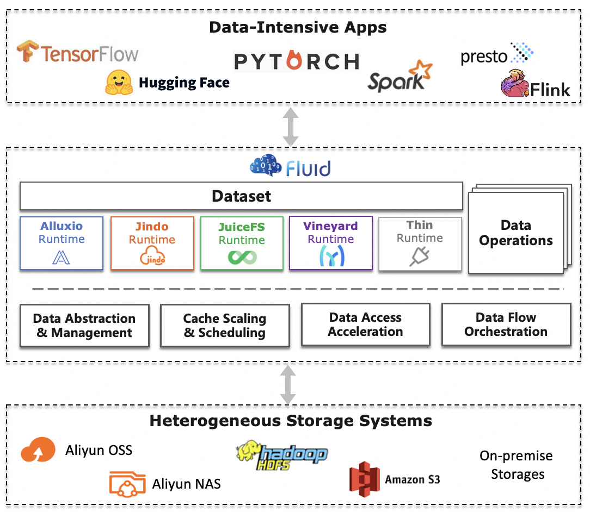

# Fluid

[English](./README.md) | 简体中文

| 最新进展：|
|------------------|
|**🎉 Fluid 正式晋升为 CNCF 孵化项目：2026年1月8日**：CNCF 技术监督委员会（TOC）已投票通过，将 Fluid 纳入 CNCF 孵化阶段——这是项目成熟度和社区影响力的重要里程碑。 |
|v1.0.8版发布：2025年10月31日，Fluid v1.0.8  发布！版本更新介绍详情参见 [CHANGELOG](CHANGELOG.md)。|
|v1.0.7版发布：2025年9月21日，Fluid v1.0.7  发布！版本更新介绍详情参见 [CHANGELOG](CHANGELOG.md)。|
|v1.0.6版发布：2025年7月12日，Fluid v1.0.6  发布！版本更新介绍详情参见 [CHANGELOG](CHANGELOG.md)。|
|进入CNCF：2021年4月27日, Fluid通过CNCF Technical Oversight Committee (TOC)投票决定被接受进入CNCF，成为[CNCF Sandbox Project](https://lists.cncf.io/g/cncf-toc/message/5822)。|

## 什么是Fluid

Fluid是一个开源的Kubernetes原生的分布式数据集编排和加速引擎，主要服务于云原生场景下的数据密集型应用，例如大数据应用、AI应用等。

Fluid现在是[Cloud Native Computing Foundation](https://cncf.io) (CNCF) 开源基金会旗下的一个孵化项目。关于Fluid更多的原理性介绍, 可以参见我们的论文: 

1. **Rong Gu, Kai Zhang, Zhihao Xu, et al. [Fluid: Dataset Abstraction and Elastic Acceleration for Cloud-native Deep Learning Training Jobs](https://ieeexplore.ieee.org/abstract/document/9835158). IEEE ICDE, pp. 2183-2196, May, 2022. (Conference Version)**

2. **Rong Gu, Zhihao Xu, Yang Che, et al. [High-level Data Abstraction and Elastic Data Caching for Data-intensive AI Applications on Cloud-native Platforms](https://ieeexplore.ieee.org/document/10249214). IEEE TPDS, pp. 2946-2964, Vol 34(11), 2023. (Journal Version)**

通过定义数据集资源的抽象，实现如下功能：

  

## 核心功能

- __数据集抽象原生支持__

  将数据密集型应用所需基础支撑能力功能化，实现数据高效访问并降低多维管理成本

- __可扩展的数据引擎插件__

	提供统一的访问接口，方便接入第三方存储，通过不同的Runtime实现数据操作

- __自动化的数据操作__

  提供多种操作模式，与自动化运维体系相结合

- __数据弹性与调度__

	将数据缓存技术和弹性扩缩容、数据亲和性调度能力相结合，提高数据访问性能

- __运行时平台无关__

	支持原生、边缘、Serverless Kubernetes集群、Kubernetes多集群等多样化环境，适用于混合云场景

## 重要概念

**Dataset**: 数据集是逻辑上相关的一组数据的集合，会被运算引擎使用，比如大数据的Spark，AI场景的TensorFlow。而这些数据智能的应用会创造工业界的核心价值。Dataset的管理实际上也有多个维度，比如安全性，版本管理和数据加速。我们希望从数据加速出发，对于数据集的管理提供支持。

**Runtime**: 实现数据集安全性，版本管理和数据加速等能力的执行引擎，定义了一系列生命周期的接口。可以通过实现这些接口，支持数据集的管理和加速。

## 先决条件

- Kubernetes version > 1.16, 支持CSI
- Golang 1.18+
- Helm 3

## 快速开始

你可以通过 [快速开始](docs/zh/userguide/get_started.md) 在Kubernetes集群中测试Fluid.

## 文档

如果需要详细了解Fluid的使用，请参考文档 [docs](docs/README_zh.md)：

- [English](docs/en/TOC.md)
- [简体中文](docs/zh/TOC.md)

你也可以访问[Fluid主页](https://fluid-cloudnative.github.io)来获取有关文档.

## 快速演示

演示 1: 加速文件访问

<pre>

</pre>

演示 2: 加速机器学习

<pre>

</pre>

演示 3: 加速PVC

<pre>

</pre>

演示 4: 数据预热

<pre>

</pre>

演示 5: 在线不停机数据集缓存扩缩容

<pre>

</pre>

## 如何贡献

欢迎您的贡献，如何贡献请参考[CONTRIBUTING.md](CONTRIBUTING.md).

## 欢迎加入与反馈

Fluid让Kubernetes真正具有分布式数据缓存的基础能力，开源只是一个起点，需要大家的共同参与。大家在使用过程发现Bug或需要的Feature，都可以直接在 [GitHub](https://github.com/fluid-cloudnative/fluid)上面提 issue 或 PR，一起参与讨论。另外我们有钉钉与微信交流群，欢迎您的参与和讨论。

钉钉讨论群

  

微信讨论群:

  

微信官方公众号:

  

Slack 讨论群
- 加入 [`CNCF Slack`](https://slack.cncf.io/) 通过搜索频道 ``#fluid`` 和我们进行讨论.

## 开源协议

Fluid采用Apache 2.0 license开源协议，详情参见[LICENSE](./LICENSE)文件。

## 漏洞报告

安全性是Fluid项目高度关注的事务。如果您发现或遇到安全相关的问题，欢迎您给fluid.opensource.project@gmail.com邮箱发送邮件报告。具体细节请查看[SECURITY.md](SECURITY.md)。

## 行为准则

Fluid 遵守 [CNCF 行为准则](https://github.com/cncf/foundation/blob/master/code-of-conduct.md)。
