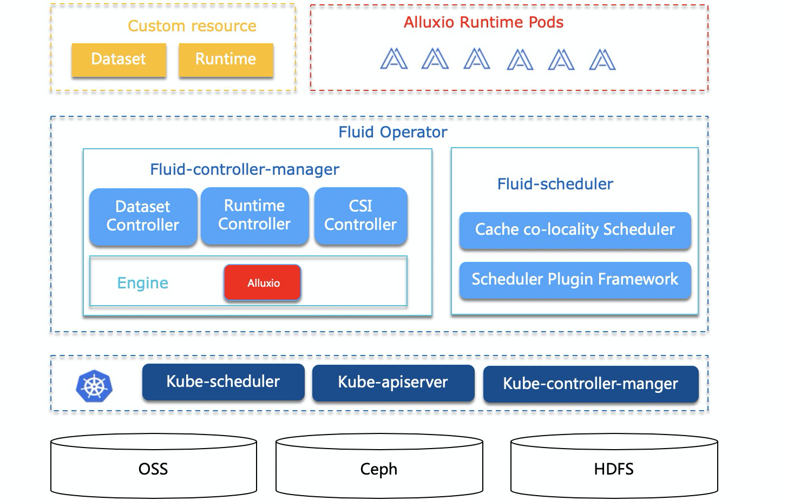

    

|:date:&nbsp;Community Meeting|
|------------------|
|The Fluid project holds bi-weekly community online meeting. To join or watch previous meeting notes and recordings, please see [meeting schedule](https://github.com/fluid-cloudnative/community/wiki/Meeting-Schedule) and [meeting minutes](https://github.com/fluid-cloudnative/community/wiki/Meeting-Agenda-and-Notes). |

## What is Fluid?
Fluid is an open source Kubernetes-native Distributed Dataset Orchestrator and Accelerator for data-intensive applications, such as big data and AI applications. It is hosted by the [Cloud Native Computing Foundation](https://cncf.io) (CNCF) as a sandbox project.

For more information, please refer to our papers:

1. **Rong Gu, Kai Zhang, Zhihao Xu, et al. [Fluid: Dataset Abstraction and Elastic Acceleration for Cloud-native Deep Learning Training Jobs](https://ieeexplore.ieee.org/abstract/document/9835158). IEEE ICDE, pp. 2183-2196, May, 2022. (Conference Version)**

2. **Rong Gu, Zhihao Xu, Yang Che, et al. [High-level Data Abstraction and Elastic Data Caching for Data-intensive AI Applications on Cloud-native Platforms](https://ieeexplore.ieee.org/document/10249214). IEEE TPDS, pp. 2946-2964, Vol 34(11), 2023. (Journal Version)**

# Fluid
English | [简体中文](./README-zh_CN.md)

|  What is NEW!  |
| ------------------------------------------------------------ |
| **Latest Release**: Apr. 17th, 2024. Fluid v1.0.0. Please check the [CHANGELOG](CHANGELOG.md) for details. |
|v0.9.0 Release: May. 26th, 2023. Fluid v0.9.0. Please check the [CHANGELOG](CHANGELOG.md) for details. |
|v0.8.0 Release: Sep. 03th, 2022. Fluid v0.8.0. Please check the [CHANGELOG](CHANGELOG.md) for details. |
|v0.7.0 Release: Mar. 02th, 2022. Fluid v0.7.0. Please check the [CHANGELOG](CHANGELOG.md) for details. |
|v0.6.0 Release:  Aug. 11th, 2021. Fluid v0.6.0. Please check the [CHANGELOG](CHANGELOG.md) for details. |
| Apr. 27th, 2021. Fluid accepted by **CNCF**! Fluid project was [accepted as an official CNCF Sandbox Project](https://lists.cncf.io/g/cncf-toc/message/5822) by CNCF Technical Oversight Committee (TOC) with a majority vote after the review process. New beginning for Fluid! . |

    

## Features

- __Dataset Abstraction__

  	Implements the unified abstraction for datasets from multiple storage sources, with observability features to help users evaluate the need for scaling the cache system.

- __Scalable Cache Runtime__

  	Offers a unified access interface for data operations with different runtimes, enabling access to third-party storage systems.

- __Automated Data Operations__

  	Provides various automated data operation modes to facilitate integration with automated operations systems.

- __Elasticity and Scheduling__

  	Enhances data access performance by combining data caching technology with elastic scaling, portability, observability, and data affinity-scheduling capabilities.

- __Runtime Platform Agnostic__

  	Supports a variety of environments and can run different storage clients based on the environment, including native, edge, Serverless Kubernetes clusters, and Kubernetes multi-cluster environments.

## Key Concepts

**Dataset**: A Dataset is a set of data logically related that can be used by computing engines, such as Spark for big data analytics and TensorFlow for AI applications. Intelligently leveraging data often creates core industry values. Managing Datasets may require features in different dimensions, such as security, version management and data acceleration. We hope to start with data acceleration to support the management of datasets. 

**Runtime**: The Runtime enforces dataset isolation/share, provides version management, and enables data acceleration by defining a set of interfaces to handle DataSets throughout their lifecycle, allowing for the implementation of management and acceleration functionalities behind these interfaces.

## Prerequisites

- Kubernetes version > 1.16, and support CSI
- Golang 1.18+
- Helm 3

## Quick Start

You can follow our [Get Started](docs/en/userguide/get_started.md) guide to quickly start a testing Kubernetes cluster.

## Documentation

You can see our documentation at [docs](docs/README.md) for more in-depth installation and instructions for production:

- [English](docs/en/TOC.md)
- [简体中文](docs/zh/TOC.md)

You can also visit [Fluid Homepage](https://fluid-cloudnative.github.io) to get relevant documents.

## Quick Demo

Demo 1: Accelerate Remote File Accessing with Fluid

<pre>

</pre>

Demo 2: Machine Learning with Fluid

<pre>

</pre>

Demo 3: Accelerate PVC with Fluid

<pre>

</pre>

Demo 4: Preload dataset with Fluid

<pre>

</pre>

Demo 5: On-the-fly dataset cache scaling

<pre>

</pre>

## Roadmap

See [ROADMAP.md](ROADMAP.md)  for the  roadmap details. It may be updated from time to time.

## Community

Feel free to reach out if you have any questions. The maintainers of this project are reachable via:

DingTalk:

  

WeChat Official Account:

  

Slack:
- Join in the [`CNCF Slack`](https://slack.cncf.io/) and navigate to the ``#fluid`` channel for discussion.

## Contributing

Contributions are highly welcomed and greatly appreciated. See [CONTRIBUTING.md](CONTRIBUTING.md) for details on submitting patches and the contribution workflow.

## Adopters

If you are interested in Fluid and would like to share your experiences with others, you are warmly welcome to add your information on [ADOPTERS.md](ADOPTERS.md) page. We will continuously discuss new requirements and feature design with you in advance.

## Open Source License

Fluid is under the Apache 2.0 license. See the [LICENSE](./LICENSE) file for details. It is vendor-neutral.

## Report Vulnerability
Security is a first priority thing for us at Fluid. If you come across a related issue, please send an email to fluid.opensource.project@gmail.com. Also see our [SECURITY.md](SECURITY.md) file for details.

## Code of Conduct

Fluid adopts [CNCF Code of Conduct](https://github.com/cncf/foundation/blob/master/code-of-conduct.md).
