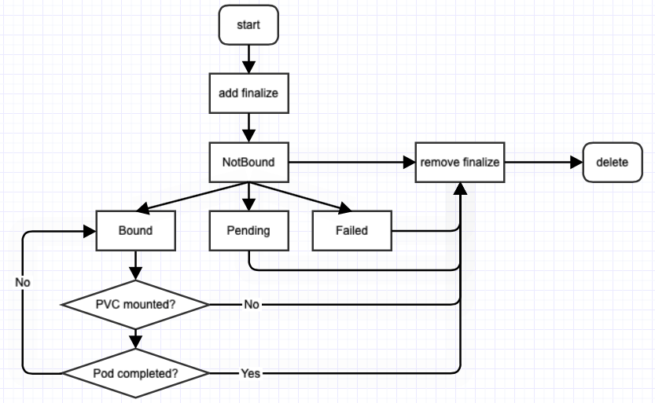
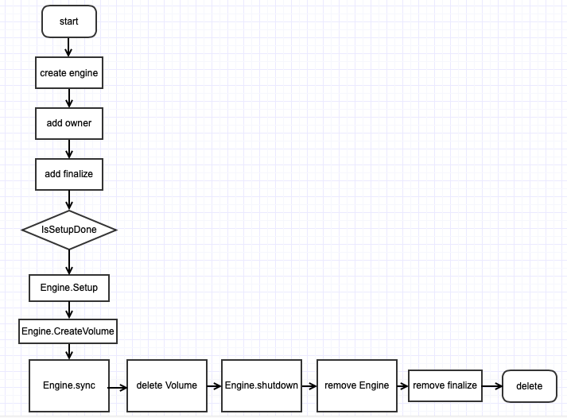

# Dataset和Runtime的生命周期
目前，Fluid支持的默认Runtime是AlluxioRuntime。
Fluid提供了Runtime接口，并且假设Runtime和Dataset是一对一的关系，支持开发者扩展不同的Runtime。
本文档介绍了Dataset和Runtime的生命周期，以及开发自己的Runtime的方法。介绍过程中，将假设用户需要基于JindoFS开发JindoRuntime。


## Dataset

Dataset的生命周期流程如图所示：



## Runtime

Runtime的生命周期流程如图所示：




其中，Engine的整体生命周期如下：

### Engine.Setup
ShouldSetupMaster：判断是否需要创建Master。  
SetupMaster：创建Master。  
CheckMasterReady：检查Master是否Ready。  
ShouldCheckUFS：判断是否需要PrepareUFS.    
PrepareUFS：为分布式缓存集群设定远端存储点。  
ShouldSetupWorkers：判断是否需要创建Worker。   
SetupWorkers：创建Worker。   
CheckWorkersReady：检查Master是否Ready。   
CheckAndUpdateRuntimeStatus：检查并更新Runtime的状态。   
UpdateDatesetStatus：更新Dataset的状态。   

### Engine.CreateVolume
CreatePV：根据存储位置创建PV。   
CreatePVC：创建PVC。   
### Engine.Sync
SyncMetadata：进行metadata的同步工作。   
CheckAndUpdateRuntimeStatus：检查并更新Runtime的状态。   
UpdateCacheOfDataset：更新Dataset的cacheStates。   
CheckRuntimeHealthy：检查分布式缓存集群的健康状态，根据检查结果修改Dataset的状态。   
SyncReplicas：比较Runtime的期待副本数和分布式缓存集群中的当前副本数。   
CheckAndUpdateRuntimeStatus：检查并更新Runtime的状态。   

# Reconciler
Fluid使用了kubebuilder生成脚手架代码，脚手架代码基于controller runtime框架实现对Controller的管理。
在controller runtime框架中，真正的事件处理通过Reconcile方法暴露给CRD开发者。每种CRD必须定义一个实现了reconcile.Reconcile接口的Reconcile结构体，开发者只需在此结构体的Reconcile方法中去处理业务逻辑就可以了。

在Fluid中，已经定义了Runtime的Reconciler：
```golang
// RuntimeReconciler is the default implementation
type RuntimeReconciler struct {
	client.Client
	Log      logr.Logger
	Recorder record.EventRecorder
	// Real implement
	implement RuntimeReconcilerInterface
}
```
其中，RuntimeReconcilerInterface接口定义了以下方法：
* ReconcileInternal、ReconcileRuntimeDeletion、AddFinalizerAndRequeue、GetRuntimeObjectMeta、GetDataset：Runtime的Reconciler已经实现。

* ReconcileRuntime：需要调用GetRuntime方法获取Runtime开发者自己定义Runtime，塞入ctx；调用ReconcileInternal实现具体逻辑。

* GetOrCreateEngine、RemoveEngine：需要Runtime开发者自己实现。

若要开发JindoRuntime，需要定义JindoRuntime的Reconciler，它是RuntimeReconcilerInterface的具体实现：
```golang
// RuntimeReconciler reconciles a JindoRuntime object
type RuntimeReconciler struct {
	Scheme  *runtime.Scheme
	engines map[string]base.Engine
	mutex   *sync.Mutex
	*controllers.RuntimeReconciler
}
```
>  其中包含了Runtime的Reconciler的地址。因此，可以通过它调用Runtime的Reconciler已经实现的方法。
>  Runtime的开发者还需要实现GetRuntime方法，以获得自己定义的Runtime。

在创建JindoRuntime的Reconciler的时候，需要先创建Runtime的Reconciler，再把它的地址添加进来：
```
func NewRuntimeReconciler(client client.Client,
	log logr.Logger,
	scheme *runtime.Scheme,
	recorder record.EventRecorder) *RuntimeReconciler {
	r := &RuntimeReconciler{
		Scheme:  scheme,
		mutex:   &sync.Mutex{},
		engines: map[string]base.Engine{},
	}
	r.RuntimeReconciler = controllers.NewRuntimeReconciler(r, client, log, recorder)
	return r
}
```
# Engine
Engine是Fluid抽象出的分布式缓存的管理引擎，Engine需要实现该接口：

```golang
type Engine interface {
   // ID returns the id
   ID() string
   // Shutdown and clean up the engine
   Shutdown() error
   // Setup the engine
   Setup(ctx cruntime.ReconcileRequestContext) (ready bool, err error)
   // Setup the Volume
   CreateVolume() (err error)
   // Destroy the Volume
   DeleteVolume() (err error)
   // Sync syncs the alluxio runtime
   Sync(ctx cruntime.ReconcileRequestContext) error
}
```
`pkg/ddc/base/template_engine.go`中，为用户提供了一份engine的实现模板：

```golang
type TemplateEngine struct {
	Implement
	Id string
	client.Client
	Log     logr.Logger
	Context cruntime.ReconcileRequestContext
}
```
>  TemplateEngine实际只实现了ID、Setup、Sync方法。CreateVolume、 DeleteVolume、Shutdown方法只是调用了Runtime开发者具体实现的方法。

TemplateEngine中包含的Implement接口是Runtime开发者的engine需要实现的接口：
```golang
// The real engine should implement
type Implement interface {
	UnderFileSystemService
	// Is the master ready
	CheckMasterReady() (ready bool, err error)
	// are the workers ready
	CheckWorkersReady() (ready bool, err error)
	// ShouldSetupMaster checks if we need setup the master
	ShouldSetupMaster() (should bool, err error)
	// ShouldSetupWorkers checks if we need setup the workers
	ShouldSetupWorkers() (should bool, err error)
	ShouldCheckUFS() (should bool, err error)
	// setup the cache master
	SetupMaster() (err error)
	// setup the cache worker
	SetupWorkers() (err error)
	// check if it's Bound to the dataset
	// IsBoundToDataset() (bound bool, err error)
	// Bind to the dataset
	UpdateDatasetStatus(phase datav1alpha1.DatasetPhase) (err error)
	// Prepare the mounts and metadata if it's not ready
	PrepareUFS() (err error)
	// Shutdown and clean up the engine
	Shutdown() error
	// AssignNodesToCache picks up the nodes for replicas
	AssignNodesToCache(desiredNum int32) (currentNum int32, err error)
	// CheckRuntimeHealthy checks runtime healthy
	CheckRuntimeHealthy() (err error)
	// UpdateCacheOfDataset updates cache of the dataset
	UpdateCacheOfDataset() (err error)
	// CheckAndUpdateRuntimeStatus checks and updates the status
	CheckAndUpdateRuntimeStatus() (ready bool, err error)
	CreateVolume() error
	// SyncReplicas syncs the replicas
	SyncReplicas(ctx cruntime.ReconcileRequestContext) error
	// SyncMetadata syncs all metadata from UFS
	SyncMetadata() (err error)
	// Destroy the Volume
	DeleteVolume() (err error)
	// BindToDataset binds the engine to dataset
	BindToDataset() (err error)
}

type UnderFileSystemService interface {
	UsedStorageBytes() (int64, error)
	FreeStorageBytes() (int64, error)
	TotalStorageBytes() (int64, error)
	TotalFileNums() (int64, error)
}
```

综上，每一个Runtime的engine都需要实现以下方法:

* CheckMasterReady
* CheckWorkersReady
* ShouldSetupMaster
* ShouldSetupWorkers
* ShouldCheckUFS
* SetupMaster
* SetupWorkers
* UpdateDatasetStatus
* PrepareUFS
* AssignNodesToCache
* CheckRuntimeHealthy
* UpdateCacheOfDataset
* BindToDataset
* CheckAndUpdateRuntimeStatus
* CreateVolume
* SyncReplicas
* SyncMetadata
* DeleteVolume
* UsedStorageBytes
* FreeStorageBytes
* TotalStorageBytes
* TotalFileNums

初始化Engine的方式可以参考`pkg/ddc/alluxio/engine.go`中的Build方法, 并且需要注册到`pkg/ddc/factory.go`  。

# 开发示例
## 安装kubebuilder
到 kubebuilder 的 [GitHub release 页面](https://github.com/kubernetes-dags/kubebuilder/releases/tag/v2.1.0)上下载与您操作系统对应的 kubebuilder 安装包。

将下载好的安装包解压后将其移动到 /usr/local/kubebuilder 目录下，并将 /usr/local/kubebuilder/bin 添加到您的 $PATH 路径下。

## 利用kubebuilder生成Runtime的控制器
创建JindoRuntimeController的相关代码：
```shell
kubebuilder create api --group data --version v1alpha1 --kind JindoRuntime --namespaced true
Create Resource [y/n]
y
Create Controller [y/n]
y
Writing scaffold for you to edit...
api/v1alpha1/jindoruntime_types.go
controllers/jindoruntime_controller.go
2020/10/25 16:21:06 error updating main.go: open main.go: no such file or directory
```

>  注意此处错误可以忽略

将`controllers/jindoruntime_controller.go`拷贝到`pkg/controllers/v1alpha1/jindo`

```shell
cd fluid
mv controllers/jindoruntime_controller.go pkg/controllers/v1alpha1/jindo
```

修改jindoruntime_controller.go如下：

```golang
package jindo

import (
	"context"
	"sync"
	"github.com/pkg/errors"
	"github.com/go-logr/logr"
	"k8s.io/apimachinery/pkg/runtime"
	"k8s.io/client-go/tools/record"
	ctrl "sigs.k8s.io/controller-runtime"
	"sigs.k8s.io/controller-runtime/pkg/client"
	datav1alpha1 "github.com/fluid-cloudnative/fluid/api/v1alpha1"
	"github.com/fluid-cloudnative/fluid/pkg/common"
	"github.com/fluid-cloudnative/fluid/pkg/controllers"
	"github.com/fluid-cloudnative/fluid/pkg/ddc/base"
	cruntime "github.com/fluid-cloudnative/fluid/pkg/runtime"
	"github.com/fluid-cloudnative/fluid/pkg/utils"
)

// Use compiler to check if the struct implements all the interface
var _ controllers.RuntimeReconcilerInterface = (*RuntimeReconciler)(nil)

// RuntimeReconciler reconciles a JindoRuntime object
type RuntimeReconciler struct {
	Scheme  *runtime.Scheme
	engines map[string]base.Engine
	mutex   *sync.Mutex
	*controllers.RuntimeReconciler
}

// NewRuntimeReconciler create controller for watching runtime custom resources created
func NewRuntimeReconciler(client client.Client,
	log logr.Logger,
	scheme *runtime.Scheme,
	recorder record.EventRecorder) *RuntimeReconciler {
	r := &RuntimeReconciler{
		Scheme:  scheme,
		mutex:   &sync.Mutex{},
		engines: map[string]base.Engine{},
	}
	r.RuntimeReconciler = controllers.NewRuntimeReconciler(r, client, log, recorder)
	return r
}

//Reconcile reconciles jindo runtime
// +kubebuilder:rbac:groups=data.fluid.io,resources=jindoruntimes,verbs=get;list;watch;create;update;patch;delete
// +kubebuilder:rbac:groups=data.fluid.io,resources=jindoruntimes/status,verbs=get;update;patch

func (r *RuntimeReconciler) Reconcile(req ctrl.Request) (ctrl.Result, error) {
	ctx := cruntime.ReconcileRequestContext{
		Context:        context.Background(),
		Log:            r.Log.WithValues("jindoruntime", req.NamespacedName),
		NamespacedName: req.NamespacedName,
		Recorder:       r.Recorder,
		Category:       common.AccelerateCategory,
		RuntimeType:    runtimeType,
		Client:         r.Client,
		FinalizerName:  runtimeResourceFinalizerName,
	}

	ctx.Log.V(1).Info("process the request", "request", req)

	//	1.Load the Runtime
	runtime, err := r.getRuntime(ctx)
	if err != nil {
		if utils.IgnoreNotFound(err) == nil {
			ctx.Log.V(1).Info("The runtime is not found", "runtime", ctx.NamespacedName)
			return ctrl.Result{}, nil
		} else {
			ctx.Log.Error(err, "Failed to get the ddc runtime")
			return utils.RequeueIfError(errors.Wrap(err, "Unable to get ddc runtime"))
		}
	}
	ctx.Runtime = runtime
	ctx.Log.V(1).Info("process the runtime", "runtime", ctx.Runtime)

	// reconcile the implement
	return r.ReconcileInternal(ctx)
}

//SetupWithManager setups the manager with RuntimeReconciler
func (r *RuntimeReconciler) SetupWithManager(mgr ctrl.Manager) error {
	return ctrl.NewControllerManagedBy(mgr).
		For(&datav1alpha1.JindoRuntime{}).
		Complete(r)
}
```
## JindoRuntim的数据结构
在jindorutime_type.go中，根据需要，修改JindoRuntimeSpec和JindoRuntimeStatus的数据结构。

可以通过添加注释，控制kubectl get命令可以查询到的信息：
```
// +kubebuilder:object:root=true
// +kubebuilder:subresource:status
// +kubebuilder:printcolumn:name="Ready Masters",type="integer",JSONPath=`.status.masterNumberReady`,priority=10
// +kubebuilder:printcolumn:name="Desired Masters",type="integer",JSONPath=`.status.desiredMasterNumberScheduled`,priority=10
// +kubebuilder:printcolumn:name="Master Phase",type="string",JSONPath=`.status.masterPhase`,priority=0
// +kubebuilder:printcolumn:name="Ready Workers",type="integer",JSONPath=`.status.workerNumberReady`,priority=10
// +kubebuilder:printcolumn:name="Desired Workers",type="integer",JSONPath=`.status.desiredWorkerNumberScheduled`,priority=10
// +kubebuilder:printcolumn:name="Worker Phase",type="string",JSONPath=`.status.workerPhase`,priority=0
// +kubebuilder:printcolumn:name="Ready Fuses",type="integer",JSONPath=`.status.fuseNumberReady`,priority=10
// +kubebuilder:printcolumn:name="Desired Fuses",type="integer",JSONPath=`.status.desiredFuseNumberScheduled`,priority=10
// +kubebuilder:printcolumn:name="Fuse Phase",type="string",JSONPath=`.status.fusePhase`,priority=0
// +kubebuilder:printcolumn:name="Age",type="date",JSONPath=`.metadata.creationTimestamp`,priority=0
// +genclient
```


## 开发Jindo Engine
创建jindo engine的文件夹：
```
mkdir pkg/ddc/jindo
```

在其中创建engine.go文件：
```golang
package jindo

import (
	"fmt"
	datav1alpha1 "github.com/fluid-cloudnative/fluid/api/v1alpha1"
	"github.com/fluid-cloudnative/fluid/pkg/ddc/base"
	cruntime "github.com/fluid-cloudnative/fluid/pkg/runtime"
	"github.com/fluid-cloudnative/fluid/pkg/utils/kubeclient"
	"github.com/go-logr/logr"
	"sigs.k8s.io/controller-runtime/pkg/client"
)
type JindoEngine struct {
	runtime     *datav1alpha1.JindoRuntime
	name        string
	namespace   string
	runtimeType string
	Log         logr.Logger
	client.Client
	//When reaching this gracefulShutdownLimits, the system is forced to clean up.
	gracefulShutdownLimits int32
	retryShutdown          int32
	initImage              string
}

func Build(id string, ctx cruntime.ReconcileRequestContext) (base.Engine, error) {
	engine := &JindoEngine{
		name:                   ctx.Name,
		namespace:              ctx.Namespace,
		Client:                 ctx.Client,
		Log:                    ctx.Log,
		runtimeType:            ctx.RuntimeType,
		gracefulShutdownLimits: 5,
		retryShutdown:          0,
	}
	// var implement base.Implement = engine
	// engine.TemplateEngine = template
	if ctx.Runtime != nil {
		runtime, ok := ctx.Runtime.(*datav1alpha1.JindoRuntime)
		if !ok {
			return nil, fmt.Errorf("engine %s is failed to parse", ctx.Name)
		}
		engine.runtime = runtime
	} else {
		return nil, fmt.Errorf("engine %s is failed to parse", ctx.Name)
	}

	template := base.NewTemplateEngine(engine, id, ctx)

	err := kubeclient.EnsureNamespace(ctx.Client, ctx.Namespace)
	return template, err
}
```
在`pkg/ddc/factory.go`中修改init函数：
```golang
func init() {
	buildFuncMap = map[string]buildFunc{
		"alluxio": alluxio.Build,
		"jindo":   jindo.Build,
	}
}
```

## 实现engine的生命周期

为JindoEngine实现刚刚介绍的那些方法，即可实现Jindo engine的生命周期。

创建PV时，如果是FusePV，可以使用Fluid提供的csi-nodeplugin，只要在PV的spec中添加如下字段：

```
 csi:
  driver: fuse.csi.fluid.io
  volumeAttributes:
   fluid_path: /runtime-mnt/jindofs
   mount_type: fuse.alluxio-fuse
```
>  将fluid_path和mount_type替换为实际的挂载目录和挂载种类。

## 修改Makefile
```
JINDORUNTIME_CONTROLLER_IMG ?= xxx/xxx

jindoruntime-controller-build: generate fmt vet
	CGO_ENABLED=0 GOOS=linux GOARCH=amd64 GO111MODULE=off  go build -gcflags="all=-N -l" -a -o bin/jindoruntime-controller -ldflags '${LDFLAGS}' cmd/jindo/main.go
docker-build-jindoruntime-controller: generate fmt vet
	docker build --no-cache . -f Dockerfile.jindoruntime -t ${JINDORUNTIME_CONTROLLER_IMG}:${GIT_VERSION}

```
执行make命令时，会在api/v1alpha1/zz_generated.deepcopy.go中自动生成CRD的deepcopy等方法。


