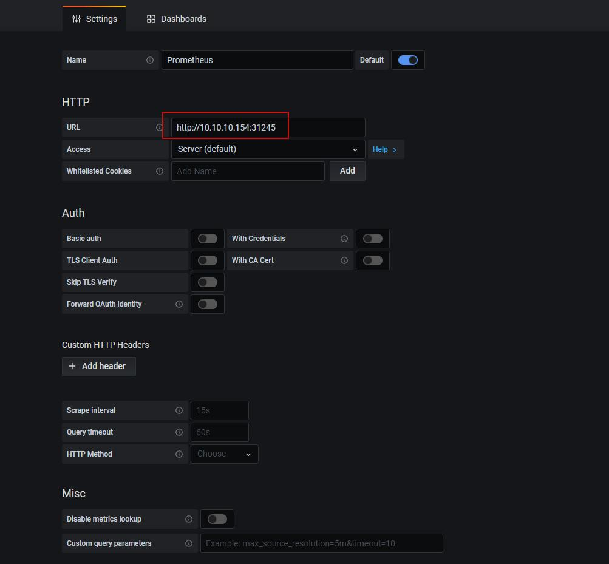
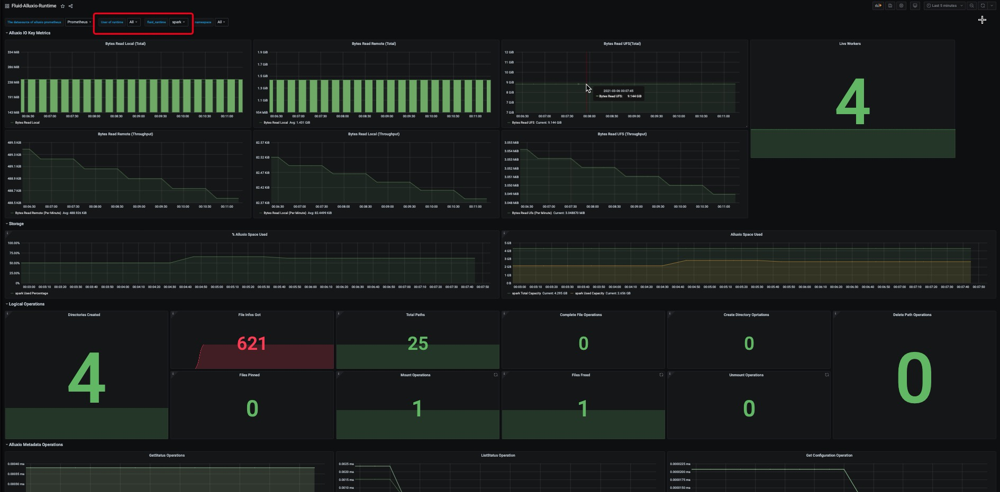

# 示例 - 部署 prometheus 和 grafana 监控 Fluid 应用
注：prometheus 需要In-Cluster部署


## 1. 部署或配置 Prometheus

如果集群内无 prometheus:

```shell
$ cd fluid
$ kubectl apply -f integration/prometheus/prometheus.yaml
```

如集群内有 prometheus,可将以下配置写到 prometheus 配置文件中:

```yaml
scrape_configs:
  - job_name: 'alluxio runtime'
    metrics_path: /metrics/prometheus
    kubernetes_sd_configs:
      - role: endpoints
    relabel_configs:
    - source_labels: [__meta_kubernetes_service_label_monitor]
      regex: alluxio_runtime_metrics
      action: keep
    - source_labels: [__meta_kubernetes_endpoint_port_name]
      regex: web
      action: keep
    - source_labels: [__meta_kubernetes_namespace]
      target_label: namespace
      replacement: $1
      action: replace
    - source_labels: [__meta_kubernetes_service_label_release]
      target_label: fluid_runtime
      replacement: $1
      action: replace
    - source_labels: [__meta_kubernetes_endpoint_address_target_name]
      target_label: pod
      replacement: $1
      action: replace
```

## 2. 部署 grafana


```shell
# docker 部署
$ docker run -d \
  -p 3000:3000 \
  --name=grafana \
  --restart=always \
  --name grafana \
  grafana/grafana
# In-CLuster 部署
$ cd fluid
$ kubectl apply -f integration/prometheus/grafana.yaml 
```


## 3. 配置 grafana

1. 登录 grafana
如果以docker 方式部署，访问 `http://$grafana-node-ip:3000`;以 In-CLuster 方式部署，访问`http://$grafana-node-ip:NodePort`，默认账号密码 `admin:admin`:

```
# 查看 NodePort
$ kubectl describe svc monitoring-grafana -n kube-system
```

2. 首先查看 prometheus svc 端口

```
$ kubectl get svc -n kube-system | grep prometheus-svc
prometheus-svc             NodePort    10.100.0.144   <none>        9090:31245/TCP           22h
$ kubectl describe svc prometheus-svc -n kube-system
Name:                     prometheus-svc
Namespace:                kube-system
Labels:                   kubernetes.io/name=Prometheus
                          name=prometheus-svc
Annotations:              kubectl.kubernetes.io/last-applied-configuration:
                            {"apiVersion":"v1","kind":"Service","metadata":{"annotations":{},"labels":{"kubernetes.io/name":"Prometheus","name":"prometheus-svc"},"nam...
Selector:                 app=prometheus
Type:                     NodePort
IP:                       10.100.0.144
Port:                     prometheus  9090/TCP
TargetPort:               9090/TCP
NodePort:                 prometheus  31245/TCP
Endpoints:                10.99.224.138:9090
Session Affinity:         None
External Traffic Policy:  Cluster
Events:                   <none>
```

3. 配置 prometheus data source



注: 如果 grafana In-Cluster 部署， URL 填写 Service Endpoints 即可；如果以 docker 方式部署，URL 填写prometheus 部署节点 ip:NodePort 即可
导入完成后点击Save & Test 显示 Data source is working 即可

4. 导入模板文件
grafana 选择导入模板 Json 文件 `fluid-prometheus-grafana-monitor.json`, 它的位置是`integration/prometheus/fluid-prometheus-grafana-monitor.json`

5. 启动 fluid 任务
```yaml
$ cat<<EOF >dataset.yaml
apiVersion: data.fluid.io/v1alpha1
kind: Dataset
metadata:
  name: spark
spec:
  mounts:
    - mountPoint: https://mirrors.bit.edu.cn/apache/spark/
      name: spark
---
apiVersion: data.fluid.io/v1alpha1
kind: AlluxioRuntime
metadata:
  name: spark
spec:
  replicas: 2
  tieredstore:
    levels:
      - mediumtype: MEM
        path: /dev/shm
        quota: 1Gi
        high: "0.95"
        low: "0.7"
  # 默认在v0.5.0版本之后，alluxio runtime已经开启了Prometheous数据，如果需要关闭可以主动设置disablePrometheus: true
  # disablePrometheus: false  
EOF
```

> 注意：默认Prometheous是开启的。如果需要关闭Prometheous，可以设置 disablePrometheus: true, 默认为 false

6. 查看监控
在 grafana HOME 中知道名为Fluid-Prometheus-Grafana-Monitor视图即可，如下所示:



注：User of runtime 对应Fluid Alluxio runtime user; fluid_runtime 对应Fluid runtime name; namespace 对应Fluid runtime namespace