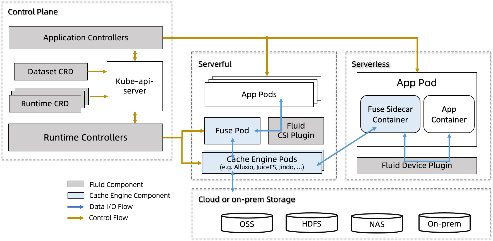

# Architecture

The overall architecture of Fluid is as follows:

  

There are two core concepts: Dataset and Runtime in Fluid. To support these two concepts, Fluid's architecture is split into **a control plane** and **a data plane**.

- Control Plane 

  - **Dataset/Runtime Manager**: Responsible for the scheduling and orchestration of datasets and their supporting runtimes in Kubernetes. This includes scheduling, migration, and elastic scaling of the runtime for datasets, as well as automated operations for dataset support, such as fine-grained data preheating, such as specifying preheating for a specific folder; controlling metadata backup and recovery to improve data access performance for scenarios with massive small files; and setting pinning policies for cached data to avoid performance fluctuations caused by data eviction.

  - **Application Manager**:  Responsible for the scheduling and operation of application Pods that use datasets, which is divided into two core components: the Scheduler and the Webhook.

    - Scheduler: schedule application Pods that use datasets in the Kubernetes cluster. By incorporating cached information obtained from the Runtime, Pods that use datasets are preferentially scheduled to nodes that have data caching, without the need for users to specify caching nodes.

    - Sidecar Webhook: For Kubernetes environments where the csi-plugin cannot be run, the Sidecar webhook automatically replaces the PVC with a FUSE sidecar and controls the startup order of containers in the Pod to ensure that the FUSE container starts first.

 - Data Plane

   - **Runtime Plugin**: As a highly extensible plugin, it can support various data access engines. Fluid achieves this by abstracting some common features, such as the use of cache media, quotas, directories, etc., making it extensible with different distributed cache engine implementation technologies. For example, the AlluxioRuntime uses a Master-Slave architecture, while the JuiceFSRuntime uses a Worker P2P architecture, both of which can be configured in the CRD of the Runtime. This plugin not only supports specific Runtimes like Alluxio and JuiceFS, but also supports a generic ThinRuntime, enabling users to access generic storage without the need for development.

   - **CSI Plugin**: The storage client is started in a containerized manner, completely decoupled from the business container. Upgrading the CSI plugin will not affect the business container, and it also supports deploying multiple versions of the storage client in the same Kubernetes cluster. Running the client independently in a Pod also provides observability within the Kubernetes system. Additionally, resource quotas can be set for the client's computing resources.