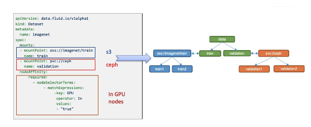

# Concept

## Dataset

A dataset is a collection of logically related data that is used by computation engines, such as Spark for big data and TensorFlow for AI. Intelligent applications of these datasets create core value for industry. 

Dataset management has multiple dimensions, including security, version control, and data acceleration. We aim to provide support for dataset management with a focus on data acceleration. For example, we support aggregation of data from different storage sources, portability, and data features.

**Data Source**: Supports multiple data sources with different protocols, including HDFS, S3, OSS, and the native Kubernetes Persistent Volume Claim protocol. Multiple data sources can also be mounted under different subdirectories in a unified namespace.

**Placement Policy**: 
cached dataset on nodes of different types using the strong and weak affinity and toleration of the nodeAffinity in Kubernetes semantics. 

  

At the same time, Dataset provides observability, such as how much data is in the dataset, how much cache space is currently available, and what the cache hit rate is. Users can use this information to decide whether to scale up or down.

  

## Runtime

Dataset is a unified abstract concept, and the actual data operations are implemented by specific runtimes. Due to the differences in storage, there are different runtime interfaces. The introduction of runtime is necessary for accessing the data. The API specification here can be defined relatively flexibly, but the lifecycle of the runtime is unifiedly defined by Fluid, and the implementer of the runtime needs to complete the specific implementation according to the common interface definition.

In Fluid, the Runtime is divided into two main categories:

1. CacheRuntime implements cache acceleration, including the open-source distributed cache Alluxio which mainly accelerates S3, HDFS, and JuiceFS, JindoFS which accelerates OSS and OSS+HDFS, and GooseFS which supports COS.  
2. ThinRuntime provides a unified access interface, such as supporting distributed storage systems like s3fs and nfs-fuse.

## Operations

Fluid's universal data operations describe operations such as data prefetch, data migration, elastic scaling, cache cleaning, metadata backup, and recovery.

### Data Prefetch

The directory to be prefetched and the preheating strategy can be one-time, scheduled, or event-triggered can be specified.

### Scale up and down

Support manual scaling, elastic scaling, and scheduled scaling as various strategies for scaling.

###  Data Migration

Supports both importing data from external storage into a dataset before using it, and using a dataset while importing data into it.

Full concept：

  

