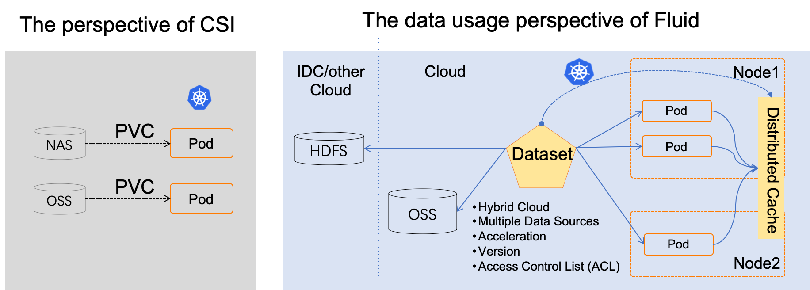

# Introduction

## Why Fluid？

1. Running AI, big data and other tasks on the cloud through a cloud-native architecture can take advantage of the elasticity of computing resources, but at the same time, it also faces data access latency and large bandwidth overhead due to the separated computing and storage architecture. Especially deep learning training with GPUs, iterative remote access to large amounts of training data will significantly slow down the computing efficiency.

2. Kubernetes provides heterogeneous storage service access and management standard interface (CSI, Container Storage Interface), but it does not define how the application uses and manages data. When running machine learning tasks, data scientists need to be able to define file features of the dataset, manage versions of the dataset, control access permissions, pre-process the dataset, accelerate heterogeneous data reading, etc. However, there is no such standard scheme in Kubernetes, which is one of the important missing capabilities of Kubernetes.

3. Kubernetes supports a variety of forms, such as native Kubernetes, edge Kubernetes and Serverless Kubernetes. However, for different forms of Kubernetes, the support for CSI plug-ins is also different, for example, many Serverless Kubernetes do not support the deployment of third-party CSI plug-ins.

## What is Fluid?

Unlike traditional PVC-based storage abstraction, Fluid takes an Application-oriented perspective to abstract the “process of using data on Kubernetes”. It introduces the concept of elastic Dataset and implements it as a first-class citizen in Kubernetes to enable Dataset CRUD operation, permission control, and access acceleration.

Fluid is responsible for converting distributed caching systems (such as Alluxio and JuiceFS) into observable caching services with self-management, elastic scaling, and self-healing capabilities, and it does so by supporting dataset operations. At the same time, through the data caching location information, Fluid can provide data-affinity scheduling for applications using datasets.

  

## Key Features：

1. **Application-oriented DataSet Unified Abstraction**：DataSet not only consolidates data from multiple storage sources, but also describes the data's portablity and features, also providing observability, such as total data volume of the DataSet, current cache space size, and cache hit rate. Users can evaluate whether a cache system needs to be scaled up or down according to this information.

2. **Lightweight but highly extensible Runtime Plugins**：Dataset is an abstract concept, and the data operation needs to be implemented by the Runtime. According to the different storages, there will be different Runtime interfaces. Fluid's Runtime is divided into two categories: CacheRuntime to accelerate data access, such as AlluxioRuntime for S3, HDFS and JuiceFSRuntime for JuiceFS; the other category is ThinRuntime, which provides a unified access interface to facilitate the access to third-party storage.

3. **Automated data operation**：Providing data prefetch, migration, backup and other operations via CRDs, and supporting various trigger modes such as one-time, scheduled, and event-driven, to facilitate users to integrate them into the automated operation and maintenance system.

4. **Data elasticity and scheduling**：By combining distributed data caching technology with autoscaling, portability, observability, and affinity scheduling capabilities, data access performance can be improved through the provision of observable, elastic scaling cache capabilities and data affinity scheduling capabilities.

5. **Runtime platform Agnostic**：Support diverse environments such as native, edge, Serverless Kubernetes cluster, Kubernetes multi-cluster, and can run in various environments such as cloud platform, edge, Kubernetes multi-cluster. It can run storage client in different modes by choosing CSI Plugin and sidecar according to the differences in environments.

## Demo：
There are demos to show how to improve the AI model traning speed in Cloud by using Fluid.

### Demo 1: Accelerate Remote File Accessing with Fluid

### Demo 2: Machine Learning with Fluid

## Quick Start

You can refer to the following documents to insall and use Fluid.

- [English](docs/en/TOC.md)
- [简体中文](docs/zh/TOC.md)

## Roadmap：

Fluid provides support for data scenarios in three stages:

1. Achieving seamless integration between computation and data to enable interoperability between computation and data.  
2. Improving data access speed through universal approaches.  
3. Coordinating workloads and data in container clusters, managing multiple datasets, and improving data management efficiency.

