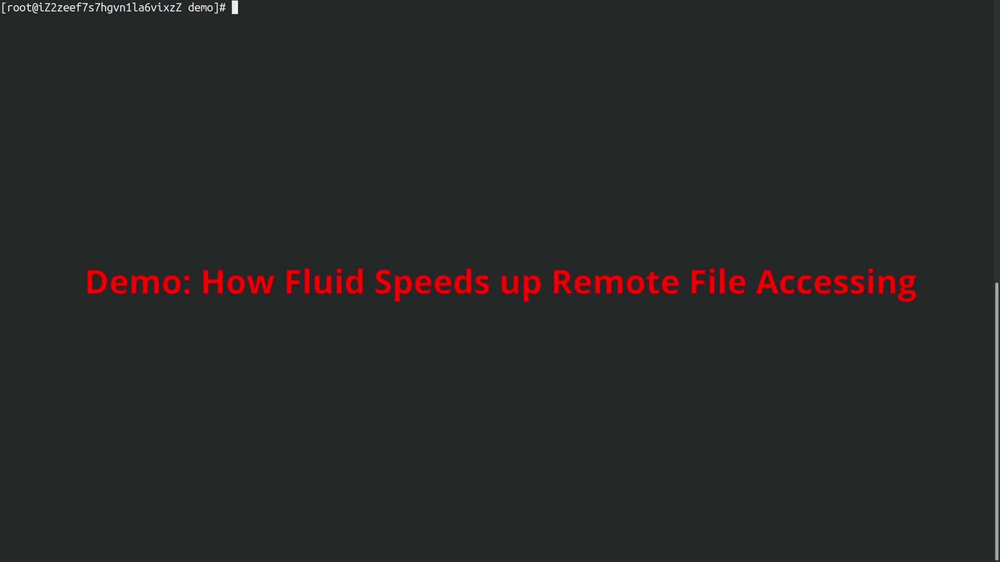
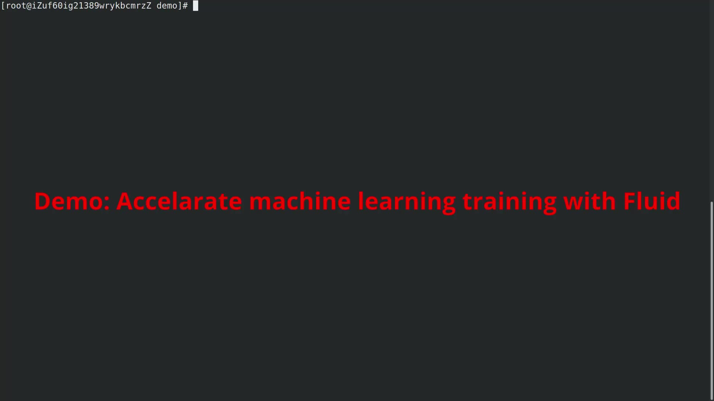
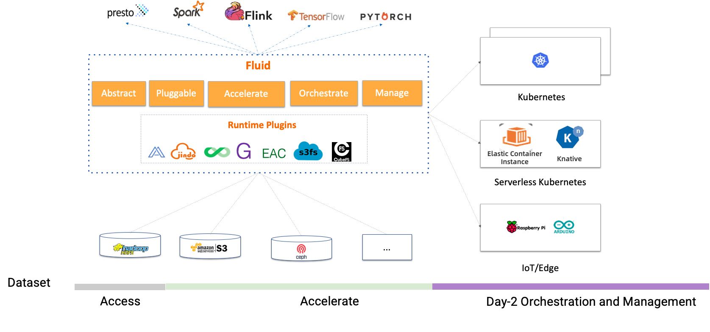

# Introduction

## Why Fluid？

1. Running AI, big data and other tasks on the cloud through a cloud-native architecture can take advantage of the elasticity of computing resources, but at the same time, it also faces data access latency and large bandwidth overhead due to the separated computing and storage architecture. Especially deep learning training with GPUs, iterative remote access to large amounts of training data will significantly slow down the computing efficiency.

2. Kubernetes provides heterogeneous storage service access and management standard interface (CSI, Container Storage Interface), but it does not define how the application uses and manages data. When running machine learning tasks, data scientists need to be able to define file features of the dataset, manage versions of the dataset, control access permissions, pre-process the dataset, accelerate heterogeneous data reading, etc. However, there is no such standard scheme in Kubernetes, which is one of the important missing capabilities of Kubernetes.

3. Kubernetes supports a variety of forms, such as native Kubernetes, edge Kubernetes and Serverless Kubernetes. However, for different forms of Kubernetes, the support for CSI plug-ins is also different, for example, many Serverless Kubernetes do not support the deployment of third-party CSI plug-ins.

## What is Fluid?

Unlike traditional PVC-based storage abstraction, Fluid takes an Application-oriented perspective to abstract the “process of using data on Kubernetes”. It introduces the concept of elastic Dataset and implements it as a first-class citizen in Kubernetes to enable Dataset CRUD operation, permission control, and access acceleration.

Fluid is responsible for converting distributed caching systems (such as Alluxio and JuiceFS) into observable caching services with self-management, elastic scaling, and self-healing capabilities, and it does so by supporting dataset operations. At the same time, through the data caching location information, Fluid can provide data-affinity scheduling for applications using datasets.

  

## Key Features：

1. **Application-oriented DataSet Unified Abstraction**：数据集抽象不仅汇总来自多个存储源的数据，还描述了数据的迁移性和特征，并提供可观测性，例如数据集的总数据量、当前缓存空间大小以及缓存命中率。用户可以根据这些信息评估是否需要对缓存系统进行扩容或缩容。

DataSet abstraction not only consolidates data from multiple storage sources, but also describes the data's migratory and characteristic properties, providing observability, such as total data volume of the DataSet, current cache space size, and cache hit rate. Users can assess whether a cache system needs to be scaled up or down according to this information.

2. **可扩展的数据引擎插件**：Dataset是统一的抽象概念，而实际的数据操作需要由具体的Runtime实现，因为不同存储的差异，会有不同的Runtime接口。Fluid的Runtime分为两大类：CacheRuntime实现数据缓存加速，如AlluxioRuntime主要加速S3、HDFS和JuiceFS；另一类是ThinRuntime，它提供统一的访问接口，方便接入第三方存储。

3. **自动化的数据操作**：以CRD的方式提供数据预热，数据迁移，数据备份等多种操作，并且支持一次性，定时和事件驱动等多种模式，方便用户结合到自动化运维体系中。

4. **通用数据加速**：将数据分布式缓存技术与自动弹性(Autoscaling)，可迁移(Portability)，可观测(Observability)，亲和性调度（Scheduling）能力相结合，通过提供可以观测，弹性扩缩容的缓存能力以及数据亲和性调度能力提升数据的访问性能。

5. **运行时平台无关**：可以支持原生、边缘、Serverless Kubernetes集群、Kubernetes多集群等多样化环境可以运行在云平台、边缘、 Kubernetes多集群等多样化环境。可以根据环境的差异选择CSI Plugin和sidecar不同模式运行存储的客户端。

## Demo：
我们提供了视频的Demo，为您展示如何通过Fluid提升数据访问速度。

### 演示 1: 加速文件访问

### 演示 2: 加速机器学习

## 快速体验Fluid
Fluid需要运行在 Kubernetes v1.14 及以上版本，并且需要支持CSI存储。Fluid Operator的部署和管理是通过 Kubernetes 平台上的包管理工具 Helm v3实现的。运行 Fluid前请确保 Helm 已经正确安装在 Kubernetes 集群里。

你可以参照参考文档 [docs](https://github.com/fluid-cloudnative/docs-fluid)，安装和使用Fluid。
- [English](docs/en/TOC.md)
- [简体中文](docs/zh/TOC.md)

## 规划：

而Fluid对于数据场景的支持，分为3个阶段:

Fluid提供了三个阶段的对数据场景的支持：

1. 实现云上计算和云下数据的无缝对接，以提供计算与数据的可互通性。  
2. 通过通用的方法来提高数据访问速度。  
3. 协调容器集群中的工作负载与数据，并管理多个数据集，以提高数据管理的效率。

