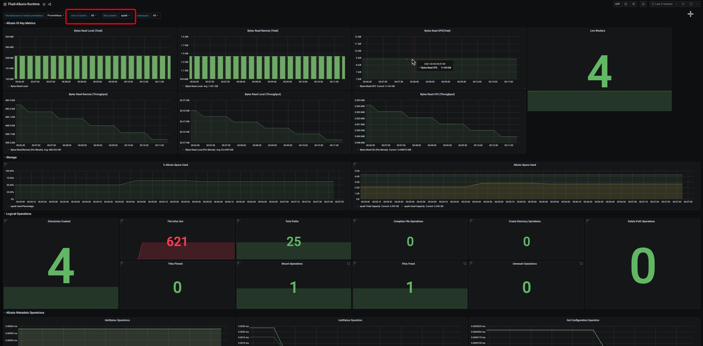

# Deploy Prometheus and Grafana to monitor Fluid applications

> Note: Prometheus requires In-Cluster deployment.

## 1. Deploy or configure Prometheus

If there is no Prometheus in your cluster, you can use the following example for a quick try. However, this method is not recommended for production use. Please follow the [Installation guide](https://prometheus.io/docs/prometheus/latest/installation/) to set up Prometheus correctly in your production environment.

```shell
$ cd community
$ kubectl apply -f integration/prometheus/prometheus.yaml
```

If you have Prometheus in your cluster, you can write the following configuration to the Prometheus configuration file:

```yaml
scrape_configs:
  - job_name: 'alluxio runtime'
    metrics_path: /metrics/prometheus
    kubernetes_sd_configs:
      - role: endpoints
    relabel_configs:
    - source_labels: [__meta_kubernetes_service_label_monitor]
      regex: alluxio_runtime_metrics
      action: keep
    - source_labels: [__meta_kubernetes_endpoint_port_name]
      regex: web
      action: keep
    - source_labels: [__meta_kubernetes_namespace]
      target_label: namespace
      replacement: $1
      action: replace
    - source_labels: [__meta_kubernetes_service_label_release]
      target_label: fluid_runtime
      replacement: $1
      action: replace
    - source_labels: [__meta_kubernetes_endpoint_address_target_name]
      target_label: pod
      replacement: $1
      action: replace
```

## 2. Deploy Grafana in a quick try if you don't have installed.


```shell
# docker deployment
$ docker run -d \
  -p 3000:3000 \
  --name=grafana \
  --restart=always \
  --name grafana \
  grafana/grafana
```

You can install grafana in Kubernetes by following [docs](https://github.com/grafana/helm-charts/blob/main/charts/grafana/README.md).


## 3. Configure Grafana

1. Log-in Grafana
For docker deployment, visit `http://$grafana-node-ip:3000`; for In-CLuster deployment, visit `http://$grafana-node-ip:NodePort` with default account and password `admin:admin`:

```
# Check NodePort
$ kubectl describe svc monitoring-grafana -n kube-system
```

2. First check the Prometheus svc port

```
$ kubectl get svc -n kube-system | grep prometheus-svc
prometheus-svc             NodePort    10.100.0.144   <none>        9090:31245/TCP           22h
$ kubectl describe svc prometheus-svc -n kube-system
Name:                     prometheus-svc
Namespace:                kube-system
Labels:                   kubernetes.io/name=Prometheus
                          name=prometheus-svc
Annotations:              kubectl.kubernetes.io/last-applied-configuration:
                            {"apiVersion":"v1","kind":"Service","metadata":{"annotations":{},"labels":{"kubernetes.io/name":"Prometheus","name":"prometheus-svc"},"nam...
Selector:                 app=prometheus
Type:                     NodePort
IP:                       10.100.0.144
Port:                     prometheus  9090/TCP
TargetPort:               9090/TCP
NodePort:                 prometheus  31245/TCP
Endpoints:                10.99.224.138:9090
Session Affinity:         None
External Traffic Policy:  Cluster
Events:                   <none>
```

3. Configure Prometheus data source


Note: For Grafana In-Cluster deployment, the URL should be Service Endpoints; for docker deployment, the URL should be Prometheus deployment node-ip:NodePort.
After importing, click Save & Test to show that the Data source is working.

4. Import the template file

Grafana chooses to import the template Json file `fluid-prometheus-grafana-monitor.json`, which is located at `integration/prometheus/fluid-prometheus-grafana-monitor.json`

5. Start Fluid Job
```yaml
$ cat<<EOF >dataset.yaml
apiVersion: data.fluid.io/v1alpha1
kind: Dataset
metadata:
  name: spark
spec:
  mounts:
    - mountPoint: https://mirrors.bit.edu.cn/apache/spark/
      name: spark
---
apiVersion: data.fluid.io/v1alpha1
kind: AlluxioRuntime
metadata:
  name: spark
spec:
  replicas: 2
  tieredstore:
    levels:
      - mediumtype: MEM
        path: /dev/shm
        quota: 1Gi
        high: "0.95"
        low: "0.7"
  # By default, after v0.5.0, aluxio runtime has Prometheus data turned on, if you need to turn it off you can actively set disablePrometheus: true
  # disablePrometheus: false  
EOF
```

> Note: Prometheus is turned on by default. If you need to turn off Prometheus, you can set disablePrometheus: true, default is false

6. Checking the monitor
In grafana HOME, you can find the view named Fluid-Prometheus-Grafana-Monitor, as follows:



Note：User of runtime correspond to Fluid Alluxio runtime user; fluid_runtime correspond to Fluid runtime name; namespace correspond to Fluid runtime namespace.