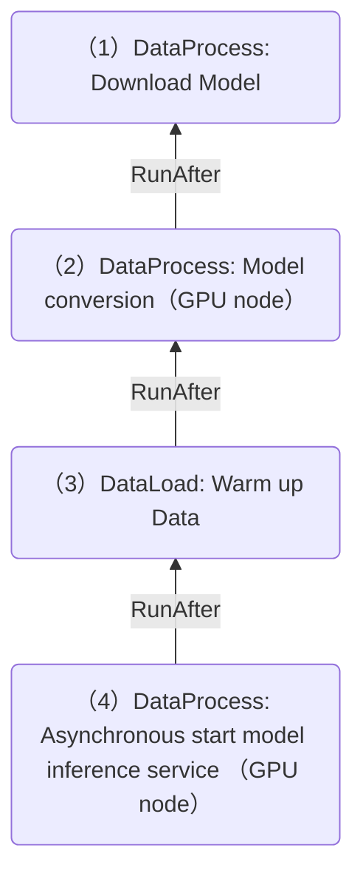

# Configuring affinity for data operations in DataFlow

Currently, Fluid supports multiple data operations (such as DataLoad/DataMigration/Data Process, etc.), and multiple data operations can be configured to form a data flow by configuring the `runAfter` field, and multiple data operations will be executed in sequence.

However, different data operations pods may run in different nodes, resulting in overall low performance:

- If the subsequent data operations are executed on the same node/zone/region as the previous one, it may improve overall execution efficiency and data processing speed. This design strategy reduces data migration across different nodes, reduces network communication overhead, and thus achieves performance optimization.

Thus, Fluid allow data operation to set pre-operation affinity tags (including `kubernetes.io/hostname`, `topology.kubernetes.io/zone`, and `topology.kubernetes.io/region`, as well as custom affinity tags) in the `runAfter` field. Therefore, subsequent data operations can have the same affinity configuration as previous data operations and run on the same node/zone/region.

Note: If the data operation runs in multiple pods, such as distributed data migration, the location affinity will not be injected.

## Prerequests

Before running this demo, please refer to the [installation documentation](../userguide/install.md) to complete the installation and check that the components of Fluid are working properly:

```shell
$ kubectl get pod -n fluid-system
alluxioruntime-controller-5b64fdbbb-84pc6   1/1     Running   0          8h
csi-nodeplugin-fluid-fwgjh                  2/2     Running   0          8h
csi-nodeplugin-fluid-ll8bq                  2/2     Running   0          8h
dataset-controller-5b7848dbbb-n44dj         1/1     Running   0          8h
thinruntime-controller-7dcbf5f45-xsf4p          1/1     Running   0          8h
```

Normally, you shall see a Pod named "dataset-controller", a Pod named "alluxioruntime-controller" and several Pods named "csi-nodeplugin". 

The num of "csi-nodeplugin" Pods depends on how many nodes your Kubernetes cluster have(e.g. 2 in this demo), so please make sure all "csi-nodeplugin" Pods are working properly.


## Demo

### Demo 1:  Location(node/zone/region) Affinity

The DataFlow consists of DataLoad A and DataLoad B, and requires B to run on the same node as A.

```yaml
apiVersion: data.fluid.io/v1alpha1
kind: Dataset
metadata:
  name: phy
spec:
  mounts:
    - mountPoint: https://mirrors.tuna.tsinghua.edu.cn/apache/flink
      name: flink
---
apiVersion: data.fluid.io/v1alpha1
kind: AlluxioRuntime
metadata:
  name: phy
spec:
  replicas: 1
  tieredstore:
    levels:
      - mediumtype: MEM
        path: /dev/shm
        quota: 1Gi
        high: "0.95"
        low: "0.7"
---
apiVersion: data.fluid.io/v1alpha1
kind: DataLoad
metadata:
  name: loadA
  annotations:
    # Built in tags that do not require explicit settings and support custom label names.
    data-operation.fluid.io/affinity.labels: "kubernetes.io/hostname,topology.kubernetes.io/zone,topology.kubernetes.io/region"
spec:
  dataset:
    name: phy
    namespace: default
---
apiVersion: data.fluid.io/v1alpha1
kind: DataLoad
metadata:
  name: loadB
spec:
  dataset:
    name: phy
    namespace: default
  runAfter:
    kind: DataLoad
    name: loadA
    # Affinity configuration
    affinityStrategy:
      # Required level, also supports Prefer, see API documentation for details
      policy: Require
      # Default equivalent to the following configuration
      # requires: 
      # - name: kubernetes.io/hostname
      
```

When DataLoad B is running,  you will find the the affinity of its pod including the affinity configuration of the DataLoad A Pod (`kubernetes.io/hostname`), so B will run on the same node as A.

## Demo 2: Customized Label Affinity

The DataFlow consists of DataLoad A and DataLoad B. DataLoad A requires running on GPU nodes through customized label `node.kubernetes.io/instance-type`, while DataLoad B requires running on nodes with the same label value as DataLoad A (GPU nodes).

- If DataLoad C (runAfter B) requires the affinity of this label, DataLoad B also needs to set the annotation `data-operation.fluid.io/affinity.labels: node.kubernetes.io/instance-type`

```yaml
apiVersion: data.fluid.io/v1alpha1
kind: Dataset
metadata:
  name: phy
spec:
  mounts:
    - mountPoint: https://mirrors.tuna.tsinghua.edu.cn/apache/flink
      name: flink
---
apiVersion: data.fluid.io/v1alpha1
kind: AlluxioRuntime
metadata:
  name: phy
spec:
  replicas: 1
  tieredstore:
    levels:
      - mediumtype: MEM
        path: /dev/shm
        quota: 1Gi
        high: "0.95"
        low: "0.7"
---
apiVersion: data.fluid.io/v1alpha1
kind: DataLoad
metadata:
  name: loadA
  annotations:
    # The customized label name must be defined here as a prerequisite for subsequent Data Operations to use it to set affinity.
    data-operation.fluid.io/affinity.labels: "node.kubernetes.io/instance-type"
spec:
  dataset:
    name: phy
    namespace: default
  affinity:
    nodeAffinity:
      requiredDuringSchedulingIgnoredDuringExecution:
        nodeSelectorTerms:
        - matchExpressions:
          - key: node.kubernetes.io/instance-type
            operator: In
            values: ["GPU"]
      
---
apiVersion: data.fluid.io/v1alpha1
kind: DataLoad
metadata:
  name: loadB
spec:
  dataset:
    name: phy
    namespace: default
  runAfter:
    kind: DataLoad
    name: loadA
    affinityStrategy:
      policy: Require
      # Require to run on a node with the same label value as the preceding operation
      requires: 
      - name: node.kubernetes.io/instance-type
```

When running loadB and checking the affinity of its Pod, it can be found that it has been injected with a required affinity value of GPU for `node.kubernetes.io/instance-type`.


### Demo 3：Dependent on any preceding operations

Fluid supports the affinity specification of data operations in DataFlow, which depends on any preceding operations. Here is an example, step 4 operation uses step 2 operation affinity:


The example configuration information for Yaml is as follows:

```yaml
apiVersion: data.fluid.io/v1alpha1
kind: DataProcess
metadata:
  name: step2-trtllm-convert
  annotations:
      # exposed affinity which will be filled in OperationStatus.
      data-operation.fluid.io/affinity.labels: "node.kubernetes.io/instance-type"
spec:
  runAfter:
    kind: DataProcess
    name: step1-download-model
    namespace: default
  # ... 
---
apiVersion: data.fluid.io/v1alpha1
kind: DataLoad
metadata:
  name: step3-warmup-cache
spec:
  runAfter:
    kind: DataProcess
    name: step2-trtllm-convert
    namespace: default
  # ... 
---
apiVersion: data.fluid.io/v1alpha1
kind: DataProcess
metadata:
  name: step4-infer-server
spec:
  runAfter:
    kind: DataLoad
    name: step3-warmup-cache
    namespace: default
    affinityStrategy:
      # get affinity from which data operation
      dependOn:
        kind: DataProcess
        name: step2-trtllm-convert
        namespace: default
      policy: Require
      # Require to run on a node with the same label value as the dependent operation
      requires: 
      - name: node.kubernetes.io/instance-type
```

