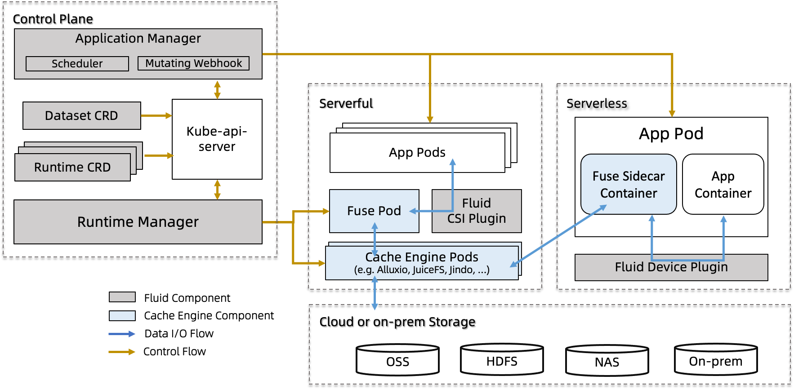

# 系统架构

Fluid的整体架构：

Fluid有两个核心概念：Dataset和Runtime。为了支持这两个概念，Fluid的架构被逻辑地划分为控制平面和数据平面。

- 控制平面 

  - **Dataset/Runtime Manager**: 主要负责数据集和支持数据集的运行时在Kubernetes中的调度和编排。负责数据集的调度，迁移和缓存运行时的弹性扩缩容；同时支持数据集的自动化运维操作，比如控制细粒度的数据预热，比如可以指定预热某个指定文件夹；控制元数据备份和恢复，提升对于海量小文件场景的数据访问性能；设置缓存数据的pin策略，避免数据驱逐导致的性能震荡。

  - **Application Manager**: 主要关心使用数据集的应用Pod的调度和运行，分为两个核心组件：Scheduler和Webhook.

    - Scheduler: 结合从Runtime获取的数据集对应运行时的部署信息信息，对于Kubernetes集群中的Pod进行调度。将使用数据集的应用优先调度到含有数据缓存的节点。

    - Sidecar Webhook: 对于无法运行csi-pluign的Kubernetes环境， Sidecar webhook会将自动的将PVC替换成 FUSE sidecar，并且控制Pod中容器启动顺序，保证FUSE容器先启动。

 - 数据平面

   - **Runtime Plugin**: 可以扩展兼容多种分布式缓存引擎。
同时Fluid抽象出了共性特征，比如对于缓存描述：使用了什么缓存介质，缓存quota，缓存目录，这些都是共性的; 而分布式缓存引擎的拓扑抽象有一定的差异性，比如alluxiomaster和slave架构，Juice是只有worker P2P的架构，可以在Rungtime的CRD中进行配置。支持Alluxio，JuiceFS等Runtime；同时也支持无需开发的通用存储接入ThinRuntime。

   - **CSI Plugin**: 以容器的方式的方式启动存储客户端，与存储客户端完全解耦，做CSI Plugin升级不会影响到业务容器，同时支持多版本存储客户端部署在同一个Kubernetes集群中；将客户端独立在 pod 中运行也就使其在 Kubernetes 体系中，提供可观测性；设置客户端的计算资源配额；同时支持一定能力的自愈。
