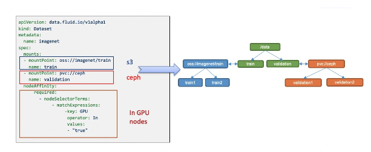
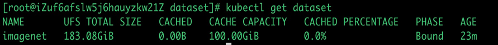
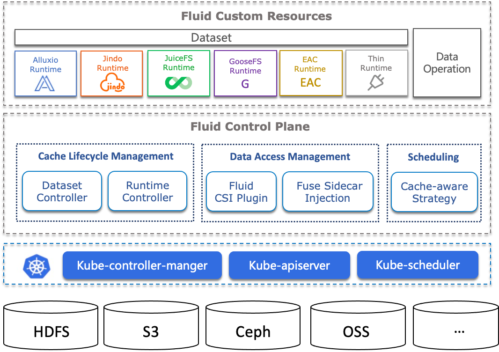

# 概念

## 数据集 Dataset

数据集是逻辑上相关的一组数据的集合，会被运算引擎使用，比如大数据的Spark，AI场景的TensorFlow。而这些数据智能的应用会创造工业界的核心价值。Dataset的管理实际上也有多个维度，比如安全性，版本管理和数据加速。我们希望从数据加速出发，对于数据集的管理提供支持。例如支持不同的存储源的数据来源聚合, 可迁移性和数据特征：

**数据来源**: 可以支持不同协议的多个数据源，包括HDFS，S3，OSS等，还有Kubernetes原生的Persistent Volume Claim协议；并且也可以将多个数据源挂载到一个统一的命名空间下不同的子目录。

**放置策略**: 可以使用Kubernetes语义中的nodeAffinity中强亲和性和弱亲和性以及toleration，将数据集可以灵活的排布在不同类型的节点。并且通过修改放置策略实现数据的可迁移性(Portability)。

**可描述的数据特征**: 为底层Runtime优化数据访问策略提供一些应用层的信息，比如某些运行时(Runtime)就会根据文件特征是小文件，进行专门的优化，而无需用户进行专门的配置。

  

同时Dataset提供了可观测性，比如该数据集的数据总量多少，目前提供的缓存空间是多大，缓存命中率是多少,用户可以根据这些信息决定是否需要扩缩容。

  

## 运行时 Runtime

Dataset是个统一的抽象概念;对于数据真正的操作，实际上由具体的Runtime实现；由于不同存储的差异，就会有不同的Runtime接口。如何真正访问数据就需要引入Runtime，这里的API Spec是可以相对灵活的定义，但是Runtime的生命周期由Fluid统一定义，Runtime的具体实现者需要依照通用接口定义完成具体实现。

Fluid中的Runtime分为两大类:

1. CacheRuntime实现缓存加速,包括开源的分布式缓存AlluxioRuntime主要加速S3，HDFS，JuiceFSRuntime加速JuiceFS, 阿里云JindoFSRuntime加速OSS和OSS+HDFS，腾讯云GooseFSRuntime支持COS。
2. ThinRuntime统一访问接口，比如支持s3fs, nfs-fuse等分布式存储系统。

## 数据操作 Operations

Fluid的通用数据操作(data operation)描述数据预热，数据迁移，弹性伸缩，缓存清理，元数据备份，恢复等操作。

### 数据预热 Dataload

可以指定预热的目录，预热策略：一次性，定时，事件触发。

### 弹性伸缩 Scale

支持手动扩缩容，弹性扩缩容，定时扩缩容等多种策略

### 数据迁移 DataMigrate

支持将外部存储中的导入数据集后开始使用和边倒入边使用策略。

完整概念：

  

