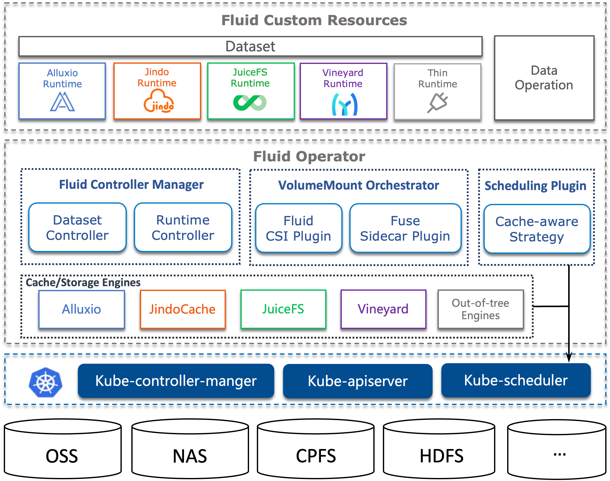

# 概念

## 数据集 Dataset

数据集抽象可以支持来自不同的存储源的数据聚合,比如 S3，HDFS，Ceph，还有PVC（Persistent Volume Claim）。在 Kubernetes 集群中，还可以指定数据集的可迁移性，例如在使用 GPU 运算时，可以将数据缓存到 GPU 节点。当计算结束后，我们可以通过修改亲和性将数据缓存到便宜的 CPU 节点上，以节省成本。同时也支持可描述的数据特征，为底层Runtime优化数据访问策略提供一些应用层的信息，比如某些运行时(Runtime)就会根据文件特征是小文件，进行专门的优化，而无需用户进行专门的配置。

同时Dataset提供了可观测性，比如该数据集的数据总量多少，目前提供的缓存空间是多大，缓存命中率是多少,用户可以根据这些信息决定是否需要扩缩容。

## 运行时 Runtime

Dataset是个统一的抽象概念;对于数据真正的操作，实际上由具体的Runtime实现；由于不同存储的差异，就会有不同的Runtime接口。如何真正访问数据就需要引入Runtime，Fluid中的Runtime分为两大类，一类是CacheRuntime实现缓存加速,包括开源的分布式缓存Alluxio主要加速S3，HDFS，JuiceFS加速JuiceFS,阿里云JindoFS加速OSS和OSS+HDFS，EAC加速NAS和CPFS，；另一类是ThinRuntime统一访问接口，比如CubeFS，CurveFS是国内互联网公司开源和维护的分布式存储系统。

## 数据操作 Operations

Fluid的通用数据操作(data operation)描述数据预热，数据迁移，弹性伸缩，缓存清理，元数据备份，恢复等操作。

