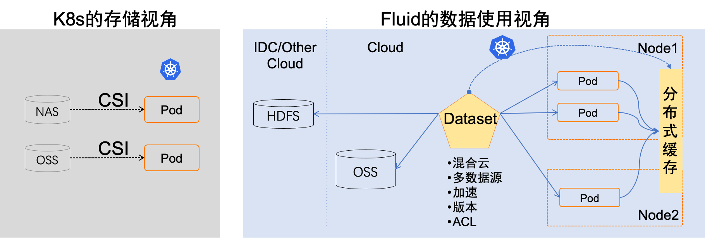
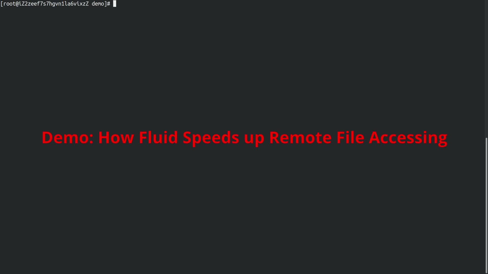
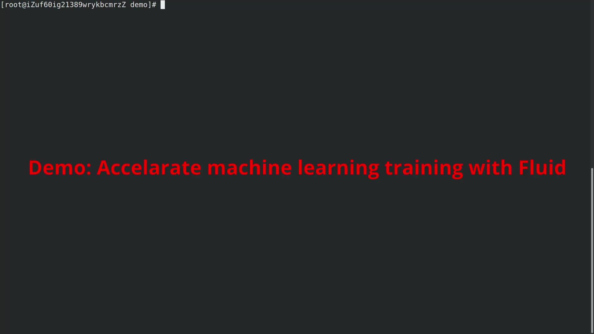
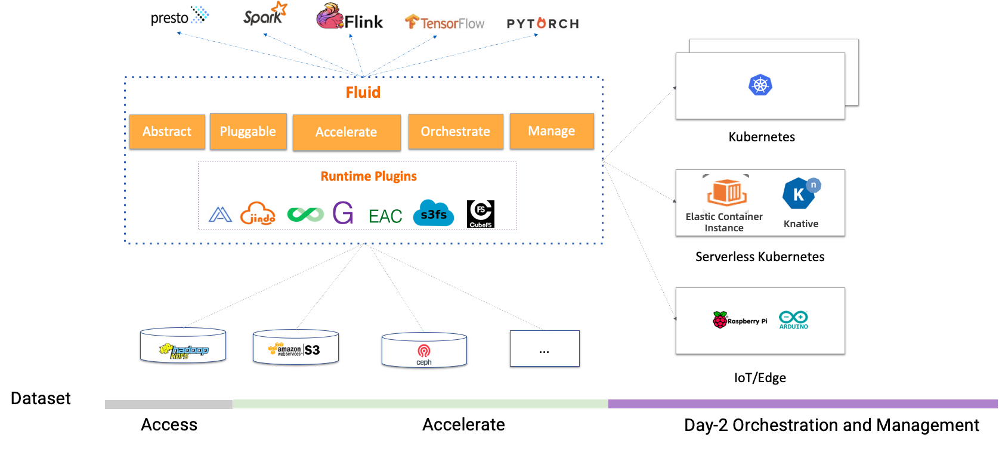

# Fluid简介

## 为什么需要Fluid

1. 在云上通过云原生架构运行AI、大数据等任务，可以享受计算资源弹性的优势，但同时也会遇到，计算和存储分离架构带来的数据访问延迟和远程拉取数据带宽开销大的挑战。尤其在GPU深度学习训练场景中，迭代式的远程读取大量训练数据方法会严重拖慢GPU计算效率。

2. Kubernetes只提供了异构存储服务接入和管理标准接口(CSI，Container Storage Interface),对应用如何在容器集群中使用和管理数据并没有定义。在运行训练任务时，数据科学家需要能够定义数据集的文件特征,管理数据集版本，控制访问权限，数据集预处理，加速异构数据读取等。但是在Kubernetes中还没有这样的标准方案，这是云原生容器社区缺失的重要能力之一。

3. Kubernetes 支持多种形态，比如原生Kubernetes，边缘Kubernetes，Serverless Kubernetes，但是对于不同形态的Kubernetes，Kubernetes不同形态的支持对于CSI插件支持程度也不同，许多Serverless Kubernetes不支持第三方的CSI插件的部署。

## 什么是Fluid

不同于传统PVC面向存储的抽象，Fluid以应用为中心的角度，对Kubernetes上”计算任务使用数据的过程”进行抽象。它提出弹性数据集Dataset概念，并作为一等公民在Kubernetes中实现，以实现数据集的CRUD操作、权限控制和访问加速等功能。

Fluid负责将分布式缓存系统（如Alluxio和JuiceFS）转换为具有自我管理、弹性扩容和自我修复能力的可观测缓存服务，并通过支持数据集的操作来实现此目的。同时，通过数据缓存的位置信息，Fluid能够为使用数据集的应用提供数据亲和性调度。

  

## 核心功能：

1. **面向应用的数据集统一抽象**：数据集抽象不仅汇总来自多个存储源的数据，还描述了数据的迁移性和特征，并提供可观测性，例如数据集的总数据量、当前缓存空间大小以及缓存命中率。用户可以根据这些信息评估是否需要对缓存系统进行扩容或缩容。

2. **可扩展的数据引擎插件**：Dataset是统一的抽象概念，而实际的数据操作需要由具体的Runtime实现，因为不同存储的差异，会有不同的Runtime接口。Fluid的Runtime分为两大类：CacheRuntime实现数据缓存加速，如AlluxioRuntime主要加速S3、HDFS，JuiceFSRuntime加速JuiceFS；另一类是ThinRuntime，它提供统一的访问接口，方便接入第三方存储。

3. **自动化的数据操作**：以CRD的方式提供数据预热，数据迁移，数据备份等多种操作，并且支持一次性，定时和事件驱动等多种模式，方便用户结合到自动化运维体系中。

4. **数据弹性与调度**：将数据分布式缓存技术与自动弹性(Autoscaling)，可迁移(Portability)，可观测(Observability)，亲和性调度（Scheduling）能力相结合，通过提供可以观测，弹性扩缩容的缓存能力以及数据亲和性调度能力提升数据的访问性能。

5. **运行时平台无关**：可以支持原生、边缘、Serverless Kubernetes集群、Kubernetes多集群等多样化环境可以运行在云平台、边缘、 Kubernetes多集群等多样化环境。可以根据环境的差异选择CSI Plugin和sidecar不同模式运行存储的客户端。

## 演示
我们提供了视频的Demo，为您展示如何通过Fluid提升数据访问速度。

### 演示 1: 加速文件访问

### 演示 2: 加速机器学习

## 快速体验Fluid
Fluid需要运行在 Kubernetes v1.14 及以上版本，并且需要支持CSI存储。Fluid Operator的部署和管理是通过 Kubernetes 平台上的包管理工具 Helm v3实现的。运行 Fluid前请确保 Helm 已经正确安装在 Kubernetes 集群里。

你可以参照参考文档 [docs](https://github.com/fluid-cloudnative/docs-fluid)，安装和使用Fluid。
- [English](docs/en/TOC.md)
- [简体中文](docs/zh/TOC.md)

## 规划：

而Fluid对于数据场景的支持，分为3个阶段:

Fluid提供了三个阶段的对数据场景的支持：

1. 实现云上计算和云下数据的无缝对接，以提供计算与数据的可互通性。  
2. 通过通用的方法来提高数据访问速度。  
3. 协调容器集群中的工作负载与数据，并管理多个数据集，以提高数据管理的效率。

