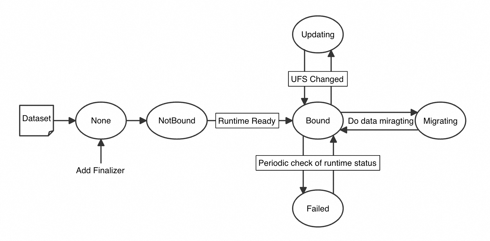
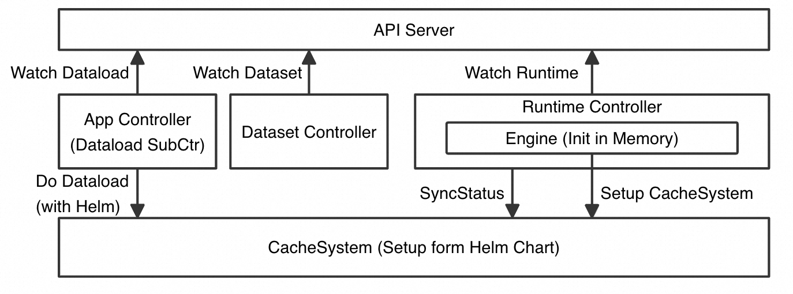
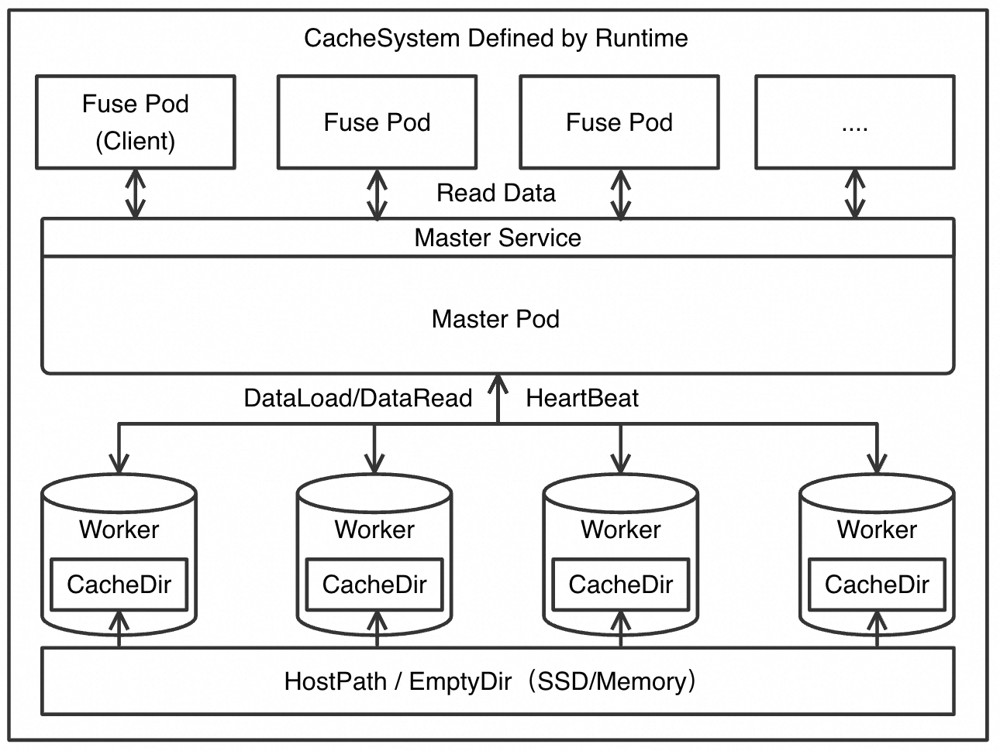
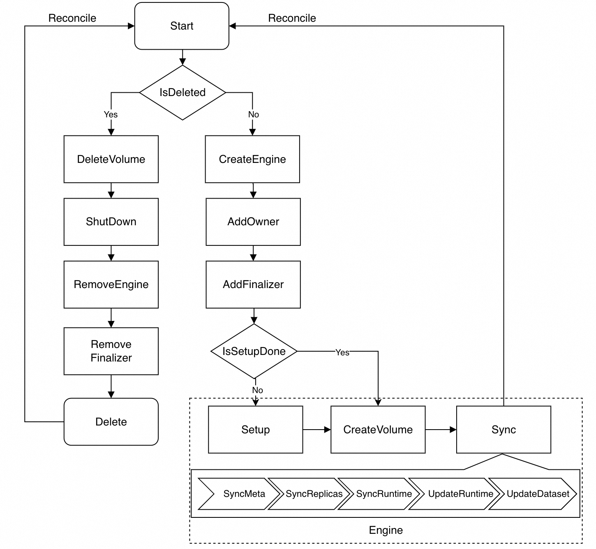

Fluid提供了Runtime接口，并且假设Runtime和Dataset是一对一的关系，支持开发者扩展不同的Runtime。 本文档介绍了Dataset和Runtime的生命周期，以及开发自己的Runtime的方法。Fluid中目前已经对接了多种存储系统的runtime实现以及多种DataOperation的能力，在本文介绍过程中，将基于JindoFS开发JindoRuntime及JindoRuntime中dataload的能力作为开发示例。

# 概念介绍

## Dataset
Fluid 的目标是为 AI 与大数据云原生应用提供一层高效便捷的数据抽象，将数据从存储抽象出来从而提供多数据源、异构数据源支持，因此Fluid定义了Dataset数据集是逻辑上相关的一组数据源的集合，被运算引擎、应用所使用。具体来说，Dataset中描述了一个或多个数据源信息，包括挂载数据源时需要使用的参数、敏感信息，如下方Dataset的示例中，定义了一个数据源的相关信息。

```yaml
apiVersion: data.fluid.io/v1alpha1
kind: Dataset
metadata:
  name: demo
spec:
  ...
  mounts:
  - mountPoint: oss://<BUCKET_NAME>/<SUBPATH>
    name: mount-point-1
    path: /mount-path-for-mount-point-1
    options:
      ......
```
Dataset的生命周期流程如图所示：



## Runtime

Runtime实现了数据集安全性、版本管理和数据加速等能力的执行引擎，定义了一系列生命周期的接口。可以通过实现这些接口，支持数据集的管理和加速，目前已经支持了众多存储系统的runtime实现：

- AlluxioRuntime：来源于Alluxio社区，是支撑Dataset数据管理和缓存的执行引擎实现，支持PVC，Ceph，CPFS加速，有效支持混合云场景。

- JuiceFSRuntime: 基于JuiceFS的分布式缓存加速引擎，支持场景化的数据缓存和加速能力。关于JuiceFS的更多信息，请参见JuiceFS简介。关于如何在Fluid中使用JuiceFS，请参见在Fluid中使用JuiceFS。

- JindoRuntime：来源于阿里云EMR团队JindoFS，是基于C++实现的支撑Dataset数据管理和缓存的执行引擎，可支持OSS对象存储、OSS-HDFS以及HDFS的数据访问加速。

- ThinRuntime：可扩展的通用存储系统实现，允许用户以低代码方式接入各类存储系统，复用Fluid提供的数据编排管理、运行时平台访问接入核心能力。

 # 架构介绍
## 整体架构


- Dataset CRD & Dataset Controller：Dataset CRD与runtime CRD结偶，即无论缓存系统是如何实现，Dataset API都是统一的，所有runtime的开发者都面向相同的Dataset API进行开发，相对应的Dataset Controller的职责主要包括：

  - 按需懒启动dataset 对应同名runtime的runtimeController 
  - 为Dataset添加Finalizer 
  - 为Dataset初始化NotBound状态 
  - 负责在用户删除Dataset时，处理Dataset删除逻辑，去除Finalizer
- Runtime  CRD & Dataset Controller：Runtime  CRD中定义了关于缓存系统的相关配置，Runtime Controller主要负责： 
  - 利用Controller中内置的helm chart模板，根据Runtime CR中用户对于缓存系统的配置进行模板渲染，在集群中部署一套缓存系统 
  - 在确认缓存系统正常工作后，将runtime，即这套缓存系统与Dataset绑定 
  - 为Dataset创建PVC与PV 
  - 定期与缓存系统同步UFS及缓存系统中最新状态 
  - 处理Runtime的更新与删除
- AppController：AppController中主要包含了DataOperationJobController，负责watch DataOperation，同样通过Controller内置的Helm Chart模板，根据DataOpertion CRD的定义进行模板渲染，创建对应的dataOperation Job，以Dataload Operation为例，会创建一个Job向缓存系统的master或worker请求数据预热。

## 缓存系统架构


| 组件     | 说明                                                                                                                                                                                                                                                                                                                                                                                                                                                                                                                                            |
|--------|-----------------------------------------------------------------------------------------------------------------------------------------------------------------------------------------------------------------------------------------------------------------------------------------------------------------------------------------------------------------------------------------------------------------------------------------------------------------------------------------------------------------------------------------------|
| Worker | 以StatefulSet形式部署，未来社区计划会有Daemonset以及AdvanceStatuefulSet形式扩展，worker负责提供分布式缓存能力，一般来说worker 之间不需要相互发现，master需要感知所有的worker，这个过程一般有几种实现方式：<br/>    - [Jindo/Alluxio] 创建worker时，将master的service通过环境变量的方式告知给Worker，worker启动后主动上报心跳给master，与master建立连接，后续被master所纳管，因此该种方式Setup中需要额外部署Master Service用于发现 <br/>- 通过 runtimecontroller 周期的 sync 来 list 出当前的 worker pod 并以 comfigmap 的形式告知 fuse 和 master，因此该种方式Setup和Sync中需要额外维护含有worker信息的Configmap <br/>  - [Juice]无Master模式，Worker节点间通过统一的元数据服务进行服务发现，因此该种方式需要额外创建元数据服务或使用Juice自身的元数据服务 |
| Master | 以StatefulSet形式部署，master中运行Fuse Client<br/> - 负责进行数据预热，将需要预热的数据写入 workers 中<br/> - 缓存统计信息收集等<br/>  - 支持多副本高可用【按需】                                                                                                                                                                                                                                                                                                                                                                                                                              |
| Fuse   | 以Deamonset形式部署，pod中含有StorageClient负责执行挂载点，并将挂载点 share 到 host 目录中，再由 fluid csi 向上提供为 PV                                                                                                                                                                                                                                                                                                                                                                                                                                                        |
|Dataload| 以Job或conJob形式创建，一般会伴随创建并挂载含有预热脚本的configmap，该Job负责触发 master 的数据预热过程                                                                                                                                                                                                                                                                                                                                                                                                                                                                            |

# 开发流程
## 定义Helm Chart - 尝试手动Setup起来一个缓存系统

一个runtime的接入首先至少需要两组Helm Chart，分别用于Fluid runtimeController构建分布式缓存系统和执行数据预热：
- Helm Chart for Setup CacheSystem

如上所述，在一个完整的Dataset、Runtime的创建、调谐的流程当中，RuntimeController会根据用户Runtime的配置，Setup起一个缓存系统，提供数据预热、数据访问的服务，这个过程在RuntimeController中利用内置Helm Chart模板渲染、部署完成的，因此在真正开始开发代码之前，我们可以先尝试手动通过Helm部署起我们的缓存系统，如下，一个完整runtime由以下的helm组成，这里我们以jindoruntime为例

```shell
jindocache
├── Chart.yaml
├── README.md
├── charts
│   └── library
├── templates
│   ├── _helpers.tpl #简化模板配置，提取公用的配置
│   ├── config
│   │   ├── jindofs-client-conf.yaml #client端配置，一般作为confimap部署
│   │   └── jindofs-conf.yaml #缓存系统数据面配置，一般作为configmap部署
│   ├── fuse
│   │   └── daemonset.yaml #客户端部署模板
│   ├── master
│   │   ├── service.yaml #master服务发现模板，用于worker向master注册以及客户端感知访问master即访问缓存系统
│   │   └── statefulset.yaml#master部署模板，这里
│   └── worker
│       └── statefulset.yaml#worker部署模板
└── values.yaml #用于模板渲染的变量值
```
按照上述的示例说明，我们可以参考JindoRuntime的helm chart，构建新开发runtime对应的helm chart，通过手动进行helm install的方式，依次master，worker，fuse构建起来。当缓存系统手动搭建起来之后，能够在fuse pod内能够通过缓存系统访问到数据，并且master能根据被动的将访问的数据缓存到worker当中的同时，master中也能够执行主动预热，在fuse pod访问之前，将数据手动预热到worker当中。

- Helm Chart for Setup Dataload

同样的，数据预热的过程是fluid  appcontroller根据Dataload CR配置，将内置的helm chart template渲染、创建一个dataload job，该job 内主要执行一个预热脚本，该脚本中缓存系统所提供的服务发现，感知到master的存在，并向其发送rpc请求，触发master执行数据预热操作，以Jindocache为例上述过程所涉及到的helm chart由以下内容构成

```shell
fluid-dataloader
├── jindocache
│   ├── CHANGELOG.md
│   ├── Chart.yaml
│   ├── charts
│   │   └── library
│   ├── templates
│   │   ├── configmap.yaml #数据预热脚本，一般作为configmap部署
│   │   ├── cronjob.yaml #以cronjob形式，运行dataload
│   │   └── job.yaml #以job形式，运行dataload
│   └── values.yaml #用于模板渲染的变量值
```

## 代码框架

RuntimeController的工作流程如下图所示



Runtime的主要工作流程由Reconciler构成，Fluid的TemplateReconciler已经实现了runtime的主干逻辑，在主干逻辑中会根据runtime的类型通过runtime开发者提供的engine构建方法，构建对应runtime engine完成runtime，runtime开发者需要实现engine所规定的接口，涉及到的主要接口如下，其中需要Runtime
开发实现的方法以*标呈现


| ReconcileInternal      | 说明                                      |
|------------------------|-----------------------------------------|
| GetOrCreateEngine      | 构建分布式缓存的管理引擎                            |
| GetRuntimeObjectMeta   | 获取runtime元信息                            |
| GetDataset             | 获取runtime对应的dataset                     |
| AddFinalizerAndRequeue | 为runtime添加finalizer                     |
| ReconcileRuntime       | 处理Runtime 的创建、更新、状态同步流程，将runtime调谐成预期状态 |
| ReconcileRuntimeDeletion | 处理Runtime 的删除                           |

| GetOrCreateEngine | 说明 |
|----------------------------------|----------|
| Build*                            | 构建分布式缓存的管理引擎        |

| ReconcileRuntime | 说明                           |
|------------------|------------------------------|
| Setup            | 部署缓存系统                       |
| CreateVolume     | 创建PVC/PV用于挂载                 |
| Sync             | 同步元信息，缓存系统状态，处理副本数、配置、UFS的更新 |

| Setup                       | 说明                    |
|-----------------------------|-----------------------|
| ShouldSetupMaster*           | 判断是否需要部署Master        |
| SetupMaster*                 | 通过Helm部署Master        |
| CheckMasterReady*            | 检查Master的部署状态         |
| ShouldCheckUFS*              | 判断是否需要PrepareUFS      |
| PrepareUFS*                  | 为分布式缓存集群设定远端存储点       |
| ShouldSetupWorkers*          | 判断是否需要部署Worker        |
| SetupWorkers*                | 部署Worker              |
| CheckWorkersReady*           | 检查Worker的部署状态         |
| CheckAndUpdateRuntimeStatus* | 检查并更新Runtime的状态       |
| BindToDataset*               | 将runtime与dataset进行绑定  |

| CreateVolume                  | 说明                          |
|-------------------------------|-----------------------------|
| CreatePv*                      | 根据Fuse NodeSelector，创建PV    |
| CreatePvc*                     | 获取runtime元信息                |

| Sync                          | 说明                                    |
|-------------------------------|---------------------------------------|
| SyncMetadata*                 | 进行metadata的同步，主要Ufs内文件的总大小（GB）以及文件的数量 |
| SyncReplicas*                 | 处理Runtime的副本数更新，进行扩缩容                 |
| SyncRuntime*                  | 处理Runtime所允许的Spec更新                   |
| CheckRuntimeHealthy*          | 检查分布式缓存集群的健康状态，根据检查结果修改Dataset的状态     |
| CheckAndUpdateRuntimeStatus*  | 更新Runtime的status                      |
| UpdateCacheOfDataset*         | 更新Dataset的cacheStates（runtime缓存系统的状态） |
| ShouldUpdateUFS*              | 判断是否应该更新远端存储点                         |
| UpdateOnUFSChange*            | 更新远端存储点                               |
| SyncScheduleInfoToCacheNodes* | 为Node添加缓存的调度信息                        |

| CheckAndUpdateRuntimeStatus                  | 说明 |
|----------------------------------------------|---------|
| UnderFileSystemService.UsedStorageBytes*      |获取缓存系统已使用存储空间       |
| UnderFileSystemService.FreeStorageBytes*      |获取缓存系统空闲存储空间       |
| UnderFileSystemService.TotalStorageBytes*     |获取缓存系统总存储空间       |
| UnderFileSystemService.TotalFileNums*         |获取缓存系统内缓存的总文件数       |


### Reconciler
Fluid使用了kubebuilder生成脚手架代码，脚手架代码基于controller runtime框架实现对Controller的管理。
在controller runtime框架中，真正的事件处理通过Reconcile方法暴露给CRD开发者。每种CRD必须定义一个实现了reconcile.Reconcile接口的Reconcile结构体，开发者只需在此结构体的Reconcile方法中去处理业务逻辑就可以了。

在Fluid中，已经定义了Runtime的Reconciler：
```golang
// RuntimeReconciler is the default implementation
type RuntimeReconciler struct {
	client.Client
	Log      logr.Logger
	Recorder record.EventRecorder
	// Real implement
	implement RuntimeReconcilerInterface
}
```
其中，RuntimeReconcilerInterface接口定义了以下方法：
* ReconcileInternal、ReconcileRuntimeDeletion、AddFinalizerAndRequeue、GetRuntimeObjectMeta、GetDataset：Runtime的Reconciler已经实现。

* ReconcileRuntime：需要调用GetRuntime方法获取Runtime开发者自己定义Runtime，塞入ctx；调用ReconcileInternal实现具体逻辑。

* GetOrCreateEngine、RemoveEngine：需要Runtime开发者自己实现。

若要开发JindoRuntime，需要定义JindoRuntime的Reconciler，它是RuntimeReconcilerInterface的具体实现：
```golang
// RuntimeReconciler reconciles a JindoRuntime object
type RuntimeReconciler struct {
	Scheme  *runtime.Scheme
	engines map[string]base.Engine
	mutex   *sync.Mutex
	*controllers.RuntimeReconciler
}
```
>  其中包含了Runtime的Reconciler的地址。因此，可以通过它调用Runtime的Reconciler已经实现的方法。
>  Runtime的开发者还需要实现GetRuntime方法，以获得自己定义的Runtime。

在创建JindoRuntime的Reconciler的时候，需要先创建Runtime的Reconciler，再把它的地址添加进来：
```
func NewRuntimeReconciler(client client.Client,
	log logr.Logger,
	scheme *runtime.Scheme,
	recorder record.EventRecorder) *RuntimeReconciler {
	r := &RuntimeReconciler{
		Scheme:  scheme,
		mutex:   &sync.Mutex{},
		engines: map[string]base.Engine{},
	}
	r.RuntimeReconciler = controllers.NewRuntimeReconciler(r, client, log, recorder)
	return r
}
```
### Engine
Engine是Fluid抽象出的分布式缓存的管理引擎，Engine需要实现该接口：

```golang
type Engine interface {
   // ID returns the id
   ID() string
   // Shutdown and clean up the engine
   Shutdown() error
   // Setup the engine
   Setup(ctx cruntime.ReconcileRequestContext) (ready bool, err error)
   // Setup the Volume
   CreateVolume() (err error)
   // Destroy the Volume
   DeleteVolume() (err error)
   // Sync syncs the alluxio runtime
   Sync(ctx cruntime.ReconcileRequestContext) error
}
```
`pkg/ddc/base/template_engine.go`中，为用户提供了一份engine的实现模板：

```golang
type TemplateEngine struct {
	Implement
	Id string
	client.Client
	Log     logr.Logger
	Context cruntime.ReconcileRequestContext
}
```
>  TemplateEngine实际只实现了ID、Setup、Sync方法。CreateVolume、 DeleteVolume、Shutdown方法只是调用了Runtime开发者具体实现的方法。

TemplateEngine中包含的Implement接口是Runtime开发者的engine需要实现的接口：
```golang
// The real engine should implement
type Implement interface {
	UnderFileSystemService
	// Is the master ready
	CheckMasterReady() (ready bool, err error)
	// are the workers ready
	CheckWorkersReady() (ready bool, err error)
	// ShouldSetupMaster checks if we need setup the master
	ShouldSetupMaster() (should bool, err error)
	// ShouldSetupWorkers checks if we need setup the workers
	ShouldSetupWorkers() (should bool, err error)
	ShouldCheckUFS() (should bool, err error)
	// setup the cache master
	SetupMaster() (err error)
	// setup the cache worker
	SetupWorkers() (err error)
	// check if it's Bound to the dataset
	// IsBoundToDataset() (bound bool, err error)
	// Bind to the dataset
	UpdateDatasetStatus(phase datav1alpha1.DatasetPhase) (err error)
	// Prepare the mounts and metadata if it's not ready
	PrepareUFS() (err error)
	// Shutdown and clean up the engine
	Shutdown() error
	// AssignNodesToCache picks up the nodes for replicas
	AssignNodesToCache(desiredNum int32) (currentNum int32, err error)
	// CheckRuntimeHealthy checks runtime healthy
	CheckRuntimeHealthy() (err error)
	// UpdateCacheOfDataset updates cache of the dataset
	UpdateCacheOfDataset() (err error)
	// CheckAndUpdateRuntimeStatus checks and updates the status
	CheckAndUpdateRuntimeStatus() (ready bool, err error)
	CreateVolume() error
	// SyncReplicas syncs the replicas
	SyncReplicas(ctx cruntime.ReconcileRequestContext) error
	// SyncMetadata syncs all metadata from UFS
	SyncMetadata() (err error)
	// Destroy the Volume
	DeleteVolume() (err error)
	// BindToDataset binds the engine to dataset
	BindToDataset() (err error)
}

type UnderFileSystemService interface {
	UsedStorageBytes() (int64, error)
	FreeStorageBytes() (int64, error)
	TotalStorageBytes() (int64, error)
	TotalFileNums() (int64, error)
}
```
初始化Engine的方式可以参考`pkg/ddc/alluxio/engine.go`中的Build方法, 并且需要注册到`pkg/ddc/factory.go`  。


# 开发示例
## 安装kubebuilder
到 kubebuilder 的 [GitHub release 页面](https://github.com/kubernetes-dags/kubebuilder/releases/tag/v2.1.0)上下载与您操作系统对应的 kubebuilder 安装包。

将下载好的安装包解压后将其移动到 /usr/local/kubebuilder 目录下，并将 /usr/local/kubebuilder/bin 添加到您的 $PATH 路径下。

## 利用kubebuilder生成Runtime的控制器
创建JindoRuntimeController的相关代码：
```shell
kubebuilder create api --group data --version v1alpha1 --kind JindoRuntime --namespaced true
Create Resource [y/n]
y
Create Controller [y/n]
y
Writing scaffold for you to edit...
api/v1alpha1/jindoruntime_types.go
controllers/jindoruntime_controller.go
2020/10/25 16:21:06 error updating main.go: open main.go: no such file or directory
```

>  注意此处错误可以忽略

将`controllers/jindoruntime_controller.go`拷贝到`pkg/controllers/v1alpha1/jindo`

```shell
cd fluid
mv controllers/jindoruntime_controller.go pkg/controllers/v1alpha1/jindo
```

修改jindoruntime_controller.go如下：

```golang
package jindo

import (
	"context"
	"sync"
	"github.com/pkg/errors"
	"github.com/go-logr/logr"
	"k8s.io/apimachinery/pkg/runtime"
	"k8s.io/client-go/tools/record"
	ctrl "sigs.k8s.io/controller-runtime"
	"sigs.k8s.io/controller-runtime/pkg/client"
	datav1alpha1 "github.com/fluid-cloudnative/fluid/api/v1alpha1"
	"github.com/fluid-cloudnative/fluid/pkg/common"
	"github.com/fluid-cloudnative/fluid/pkg/controllers"
	"github.com/fluid-cloudnative/fluid/pkg/ddc/base"
	cruntime "github.com/fluid-cloudnative/fluid/pkg/runtime"
	"github.com/fluid-cloudnative/fluid/pkg/utils"
)

// Use compiler to check if the struct implements all the interface
var _ controllers.RuntimeReconcilerInterface = (*RuntimeReconciler)(nil)

// RuntimeReconciler reconciles a JindoRuntime object
type RuntimeReconciler struct {
	Scheme  *runtime.Scheme
	engines map[string]base.Engine
	mutex   *sync.Mutex
	*controllers.RuntimeReconciler
}

// NewRuntimeReconciler create controller for watching runtime custom resources created
func NewRuntimeReconciler(client client.Client,
	log logr.Logger,
	scheme *runtime.Scheme,
	recorder record.EventRecorder) *RuntimeReconciler {
	r := &RuntimeReconciler{
		Scheme:  scheme,
		mutex:   &sync.Mutex{},
		engines: map[string]base.Engine{},
	}
	r.RuntimeReconciler = controllers.NewRuntimeReconciler(r, client, log, recorder)
	return r
}

//Reconcile reconciles jindo runtime
// +kubebuilder:rbac:groups=data.fluid.io,resources=jindoruntimes,verbs=get;list;watch;create;update;patch;delete
// +kubebuilder:rbac:groups=data.fluid.io,resources=jindoruntimes/status,verbs=get;update;patch

func (r *RuntimeReconciler) Reconcile(req ctrl.Request) (ctrl.Result, error) {
	ctx := cruntime.ReconcileRequestContext{
		Context:        context.Background(),
		Log:            r.Log.WithValues("jindoruntime", req.NamespacedName),
		NamespacedName: req.NamespacedName,
		Recorder:       r.Recorder,
		Category:       common.AccelerateCategory,
		RuntimeType:    runtimeType,
		Client:         r.Client,
		FinalizerName:  runtimeResourceFinalizerName,
	}

	ctx.Log.V(1).Info("process the request", "request", req)

	//	1.Load the Runtime
	runtime, err := r.getRuntime(ctx)
	if err != nil {
		if utils.IgnoreNotFound(err) == nil {
			ctx.Log.V(1).Info("The runtime is not found", "runtime", ctx.NamespacedName)
			return ctrl.Result{}, nil
		} else {
			ctx.Log.Error(err, "Failed to get the ddc runtime")
			return utils.RequeueIfError(errors.Wrap(err, "Unable to get ddc runtime"))
		}
	}
	ctx.Runtime = runtime
	ctx.Log.V(1).Info("process the runtime", "runtime", ctx.Runtime)

	// reconcile the implement
	return r.ReconcileInternal(ctx)
}

//SetupWithManager setups the manager with RuntimeReconciler
func (r *RuntimeReconciler) SetupWithManager(mgr ctrl.Manager) error {
	return ctrl.NewControllerManagedBy(mgr).
		For(&datav1alpha1.JindoRuntime{}).
		Complete(r)
}
```
## JindoRuntim的数据结构
在jindorutime_type.go中，根据需要，修改JindoRuntimeSpec和JindoRuntimeStatus的数据结构。

可以通过添加注释，控制kubectl get命令可以查询到的信息：
```
// +kubebuilder:object:root=true
// +kubebuilder:subresource:status
// +kubebuilder:printcolumn:name="Ready Masters",type="integer",JSONPath=`.status.masterNumberReady`,priority=10
// +kubebuilder:printcolumn:name="Desired Masters",type="integer",JSONPath=`.status.desiredMasterNumberScheduled`,priority=10
// +kubebuilder:printcolumn:name="Master Phase",type="string",JSONPath=`.status.masterPhase`,priority=0
// +kubebuilder:printcolumn:name="Ready Workers",type="integer",JSONPath=`.status.workerNumberReady`,priority=10
// +kubebuilder:printcolumn:name="Desired Workers",type="integer",JSONPath=`.status.desiredWorkerNumberScheduled`,priority=10
// +kubebuilder:printcolumn:name="Worker Phase",type="string",JSONPath=`.status.workerPhase`,priority=0
// +kubebuilder:printcolumn:name="Ready Fuses",type="integer",JSONPath=`.status.fuseNumberReady`,priority=10
// +kubebuilder:printcolumn:name="Desired Fuses",type="integer",JSONPath=`.status.desiredFuseNumberScheduled`,priority=10
// +kubebuilder:printcolumn:name="Fuse Phase",type="string",JSONPath=`.status.fusePhase`,priority=0
// +kubebuilder:printcolumn:name="Age",type="date",JSONPath=`.metadata.creationTimestamp`,priority=0
// +genclient
```


## 开发Jindo Engine
创建jindo engine的文件夹：
```
mkdir pkg/ddc/jindo
```

在其中创建engine.go文件：
```golang
package jindo

import (
	"fmt"
	datav1alpha1 "github.com/fluid-cloudnative/fluid/api/v1alpha1"
	"github.com/fluid-cloudnative/fluid/pkg/ddc/base"
	cruntime "github.com/fluid-cloudnative/fluid/pkg/runtime"
	"github.com/fluid-cloudnative/fluid/pkg/utils/kubeclient"
	"github.com/go-logr/logr"
	"sigs.k8s.io/controller-runtime/pkg/client"
)
type JindoEngine struct {
	runtime     *datav1alpha1.JindoRuntime
	name        string
	namespace   string
	runtimeType string
	Log         logr.Logger
	client.Client
	//When reaching this gracefulShutdownLimits, the system is forced to clean up.
	gracefulShutdownLimits int32
	retryShutdown          int32
	initImage              string
}

func Build(id string, ctx cruntime.ReconcileRequestContext) (base.Engine, error) {
	engine := &JindoEngine{
		name:                   ctx.Name,
		namespace:              ctx.Namespace,
		Client:                 ctx.Client,
		Log:                    ctx.Log,
		runtimeType:            ctx.RuntimeType,
		gracefulShutdownLimits: 5,
		retryShutdown:          0,
	}
	// var implement base.Implement = engine
	// engine.TemplateEngine = template
	if ctx.Runtime != nil {
		runtime, ok := ctx.Runtime.(*datav1alpha1.JindoRuntime)
		if !ok {
			return nil, fmt.Errorf("engine %s is failed to parse", ctx.Name)
		}
		engine.runtime = runtime
	} else {
		return nil, fmt.Errorf("engine %s is failed to parse", ctx.Name)
	}

	template := base.NewTemplateEngine(engine, id, ctx)

	err := kubeclient.EnsureNamespace(ctx.Client, ctx.Namespace)
	return template, err
}
```
在`pkg/ddc/factory.go`中修改init函数：
```golang
func init() {
	buildFuncMap = map[string]buildFunc{
		"alluxio": alluxio.Build,
		"jindo":   jindo.Build,
	}
}
```

## 实现engine的生命周期

为JindoEngine实现刚刚介绍的那些方法，即可实现Jindo engine的生命周期。

创建PV时，如果是FusePV，可以使用Fluid提供的csi-nodeplugin，只要在PV的spec中添加如下字段：

```
 csi:
  driver: fuse.csi.fluid.io
  volumeAttributes:
   fluid_path: /runtime-mnt/jindofs
   mount_type: fuse.alluxio-fuse
```
>  将fluid_path和mount_type替换为实际的挂载目录和挂载种类。

## 修改Makefile
```
JINDORUNTIME_CONTROLLER_IMG ?= xxx/xxx

jindoruntime-controller-build: generate fmt vet
	CGO_ENABLED=0 GOOS=linux GOARCH=amd64 GO111MODULE=off  go build -gcflags="all=-N -l" -a -o bin/jindoruntime-controller -ldflags '${LDFLAGS}' cmd/jindo/main.go
docker-build-jindoruntime-controller: generate fmt vet
	docker build --no-cache . -f Dockerfile.jindoruntime -t ${JINDORUNTIME_CONTROLLER_IMG}:${GIT_VERSION}

```
执行make命令时，会在api/v1alpha1/zz_generated.deepcopy.go中自动生成CRD的deepcopy等方法。


