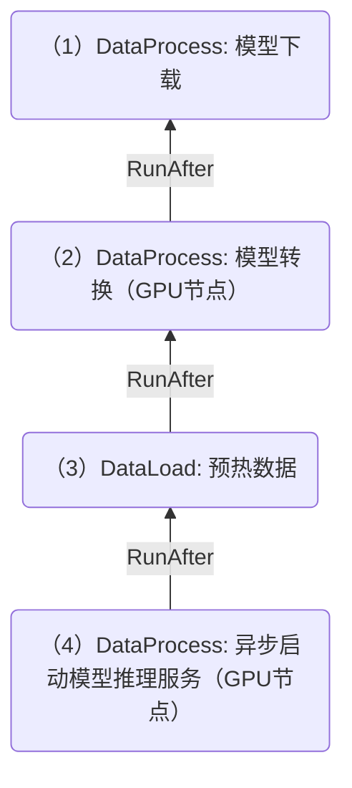

# DataFlow中配置数据操作的亲和性

当前 Fluid 支持多种数据操作（DataLoad/DataMigrate/DataProcess等)，并且可以通过配置`runAfter`字段将多个数据操作构成数据流（DataFlow），多个数据操作按顺序执行。

但是不同的数据操作的 Pod 在执行时，可能会在不同的节点，导致整体性能不高：

- 如果后面的数据操作跟前面的数据操作在同样的 node/zone/region 上执行，则可能会提高整体执行效率和数据处理速度。这种设计策略减少了跨不同节点的数据迁移，减少了网络通信开销，从而实现了性能优化。

Fluid 支持数据操作在`runAfter`字段中配置前置操作亲和性标签（包括`kubernetes.io/hostname`, `topology.kubernetes.io/zone`, and `topology.kubernetes.io/region`以及自定义的亲和性），因此后面的数据操作可以跟前面的数据操作具备同样的亲和性配置，运行在同一个node/zone/region 中。

注意：如果数据操作是个分布式操作，如 DataMigrate 配置分布式迁移，则不注入位置亲和性信息。


## 前提条件

在运行该示例之前，请参考[安装文档](../userguide/install.md)完成安装，并检查Fluid各组件正常运行：

```shell
$ kubectl get pod -n fluid-system
NAME                                  READY   STATUS    RESTARTS   AGE
alluxioruntime-controller-5b64fdbbb-84pc6   1/1     Running   0          8h
csi-nodeplugin-fluid-fwgjh                  2/2     Running   0          8h
csi-nodeplugin-fluid-ll8bq                  2/2     Running   0          8h
dataset-controller-5b7848dbbb-n44dj         1/1     Running   0          8h
```

通常来说，你会看到一个名为`controller-manager`的Pod和多个名为`csi-nodeplugin`的Pod正在运行。其中，`csi-nodeplugin`这些Pod的数量取决于你的Kubernetes集群中结点的数量。


## 运行示例

### 示例1：位置信息（node/zone/region）的亲和性

DataFlow  由 DataLoad A, DataLoad B 构成 ，要求 B 跟 A 运行在同一个 Node 中；

```yaml
apiVersion: data.fluid.io/v1alpha1
kind: Dataset
metadata:
  name: phy
spec:
  mounts:
    - mountPoint: https://mirrors.tuna.tsinghua.edu.cn/apache/flink
      name: flink
---
apiVersion: data.fluid.io/v1alpha1
kind: AlluxioRuntime
metadata:
  name: phy
spec:
  replicas: 1
  tieredstore:
    levels:
      - mediumtype: MEM
        path: /dev/shm
        quota: 1Gi
        high: "0.95"
        low: "0.7"
---
apiVersion: data.fluid.io/v1alpha1
kind: DataLoad
metadata:
  name: loadA
  annotations:
    # 内置的标签，可以不显式设置，支持自定义的标签名
    data-operation.fluid.io/affinity.labels: "kubernetes.io/hostname,topology.kubernetes.io/zone,topology.kubernetes.io/region"
spec:
  dataset:
    name: phy
    namespace: default
---
apiVersion: data.fluid.io/v1alpha1
kind: DataLoad
metadata:
  name: loadB
spec:
  dataset:
    name: phy
    namespace: default
  runAfter:
    kind: DataLoad
    name: loadA
    # 亲和性配置
    affinityStrategy:
      # Require 级别，也支持 Prefer，详见API文档
      policy: Require
      # 默认等价于下面的配置，也可以配置 loadA 中的其它亲和性标签
      # requires: 
      # - name: kubernetes.io/hostname
      
```

在loadB 运行的时候，查看其Pod 的亲和性，可以发现被注入 loadA 的 Pod 所在的节点的亲和性配置，因此 B 会在跟 A 同样的节点上运行。

### 示例2：自定义标签的亲和性

DataFlow  由 DataLoad A, DataLoad B 构成，DataLoad A 通过自定义标签`node.kubernetes.io/instance-type`要求运行在 GPU 节点上，DataLoad B要求运行在跟DataLoad A 同样的标签值的节点（即GPU节点)；
- 如果后续还有 DataLoad C (runAfter B) 需要该标签的亲和性，则 DataLoad B也需要设置 `data-operation.fluid.io/affinity.labels: "node.kubernetes.io/instance-type"` 的注解；
```yaml
apiVersion: data.fluid.io/v1alpha1
kind: Dataset
metadata:
  name: phy
spec:
  mounts:
    - mountPoint: https://mirrors.tuna.tsinghua.edu.cn/apache/flink
      name: flink
---
apiVersion: data.fluid.io/v1alpha1
kind: AlluxioRuntime
metadata:
  name: phy
spec:
  replicas: 1
  tieredstore:
    levels:
      - mediumtype: MEM
        path: /dev/shm
        quota: 1Gi
        high: "0.95"
        low: "0.7"
---
apiVersion: data.fluid.io/v1alpha1
kind: DataLoad
metadata:
  name: loadA
  annotations:
    # 自定义的标签名，前置操作必须将标签显示定义在这里，后续的 Data Operation 才可以使用该标签设置亲和性
    data-operation.fluid.io/affinity.labels: "node.kubernetes.io/instance-type"
spec:
  dataset:
    name: phy
    namespace: default
  affinity:
    nodeAffinity:
      requiredDuringSchedulingIgnoredDuringExecution:
        nodeSelectorTerms:
        - matchExpressions:
          - key: node.kubernetes.io/instance-type
            operator: In
            values: ["GPU"]
      
---
apiVersion: data.fluid.io/v1alpha1
kind: DataLoad
metadata:
  name: loadB
spec:
  dataset:
    name: phy
    namespace: default
  runAfter:
    kind: DataLoad
    name: loadA
    affinityStrategy:
      policy: Require
      # 要求跟前置操作运行在具备同样标签值的节点
      requires: 
      - name: node.kubernetes.io/instance-type
      
```

在loadB 运行的时候，查看其Pod 的亲和性，可以发现被注入了`node.kubernetes.io/instance-type`值为`GPU`的强制亲和性。


### 示例3：依赖非直接前置的操作

Fluid 支持 DataFlow 中的数据操作的亲和性指定依赖任意的前置操作。如下是个示例，步骤4的数据操作依赖步骤2的操作的亲和性：



Yaml 的示例配置信息如下

```yaml
apiVersion: data.fluid.io/v1alpha1
kind: DataProcess
metadata:
  name: step2-trtllm-convert
  annotations:
      # exposed affinity which will be filled in OperationStatus.
      data-operation.fluid.io/affinity.labels: "node.kubernetes.io/instance-type"
spec:
  runAfter:
    kind: DataProcess
    name: step1-download-model
    namespace: default
  # ... 
---
apiVersion: data.fluid.io/v1alpha1
kind: DataLoad
metadata:
  name: step3-warmup-cache
spec:
  runAfter:
    kind: DataProcess
    name: step2-trtllm-convert
    namespace: default
  # ... 
---
apiVersion: data.fluid.io/v1alpha1
kind: DataProcess
metadata:
  name: step4-infer-server
spec:
  runAfter:
    kind: DataLoad
    name: step3-warmup-cache
    namespace: default
    affinityStrategy:
      # get affinity from which data operation
      dependOn:
        kind: DataProcess
        name: step2-trtllm-convert
        namespace: default
      policy: Require
      # Require to run on a node with the same label value as the dependent operation
      requires: 
      - name: node.kubernetes.io/instance-type
```

