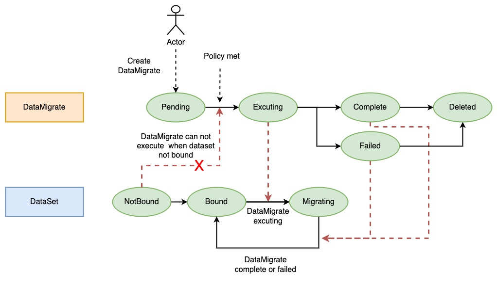

# 示例 - JuiceFSRuntime 数据迁移

JuiceFS 本质是一个 POSIX 兼容的文件系统，当存量数据存在对象存储中，需要用 JuiceFS 访问数据时，需要先将数据导入到 JuiceFS
中。本文讲述如何 Fluid 中针对 JuiceFSRuntime 的 Dataset 做数据迁移。

## Dataset & JuiceFSRuntime

数据迁移是在数据集的基础上的，所以首先需要先创建一个 Dataset 和
JuiceFSRuntime。具体请参考文档[示例 - 如何在 Fluid 中使用 JuiceFS](juicefs_runtime.md)，这里不再赘述。

## 数据迁移

在 Dataset 可用（Bound 状态）之后，接下来可以通过 DataMigrate 来加速数据访问。以下是一个 DataMigrate 的示例：

```yaml
apiVersion: data.fluid.io/v1alpha1
kind: DataMigrate
metadata:
  name: jfs-migrate
spec:
  image: registry.cn-hangzhou.aliyuncs.com/juicefs/juicefs-fuse
  imageTag: nightly
  from:
    externalStorage:
      uri: minio://minio.default.svc.cluster.local:9000/test/
      encryptOptions:
        - name: access-key
          valueFrom:
            secretKeyRef:
              name: jfs-secret
              key: accesskey
        - name: secret-key
          valueFrom:
            secretKeyRef:
              name: jfs-secret
              key: secretkey
  to:
    dataset:
      name: jfsdemo
      namespace: default
      path: /dir1
  options:
    "exclude": "4.png"
```

其中：

- `spec.image`：指定数据迁移的 job 使用的镜像；
- `spec.imageTag`：指定数据迁移的 job 使用的镜像的 tag；
- `spec.from`/`spec.to`：指定数据迁移的源和目标；
- `spec.from(/to).externalStorage`：表明需要迁移的数据是外部的存储，可以是 oss、s3 等；
- `spec.from(/to).externalStorage.uri`：外部存储的 uri；
- `spec.from(/to).externalStorage.encryptOptions`：外部存储的加密参数，access-key、secret-key 是固定格式，表示对象存储的
  aksk；
- `spec.from(/to).dataset`：表明需要迁移数据的 dataset；
- `spec.from(/to).dataset.name`：需要迁移数据的 dataset 的 name；
- `spec.from(/to).dataset.namespace`：需要迁移数据的 dataset 的 namespace；
- `spec.from(/to).dataset.path`：需要迁移数据的 dataset 的子路径；
- `spec.options`：juicefs sync 的参数，具体请参考[文档](https://juicefs.com/docs/zh/community/command_reference#juicefs-sync)。

[分布式同步](https://juicefs.com/docs/zh/community/guide/sync#distributed-sync)：在同步大量数据时，单机带宽往往会被占满出现瓶颈，
针对这种情况，提供多Pod并发同步支持（Pod彼此间具备反亲和性），相关参数如下：
- `spec.parallelism`：启动用于同步的Worker 的总数量，默认为1；
- `spec.parallelOptions`：当 spec.parallelism 大于 1时，用于设置并发同步的相关参数，当前支持：
  - `sshSecretName`: 必选，无默认值，Workers 间的 SSH 免密配置的 Secret 的名称，必须包含`ssh-privatekey`和`ssh-publickey`；
  - `sshPort`: 可选，默认22，Workers 间的 SSH 端口；
  - `sshReadyTimeoutSeconds`：可选，默认180，等待所有Workers都准备好SSH连接前的超时时间；

### 基于 PVC 的 DataMigrate

DataMigrate 还支持以 PVC 的形式作为数据源，需要额外准备需要迁移的 PVC，Fluid 会将已有的 PVC 挂载到执行 DataMigrate 的 Job 中。
以下是一个 DataMigrate 的示例，PVC 名为 `oss-pvc`：

```yaml
apiVersion: data.fluid.io/v1alpha1
kind: DataMigrate
metadata:
  name: jfs-migrate
spec:
  from:
    externalStorage:
      uri: pvc://oss-pvc/subpath
  to:
    dataset:
      name: jfsdemo
      namespace: default
```

只需要在 uri 中声明 PVC 的名称即可，格式为 `pvc://<pvc-name>/<subpath>`。

## DataMigrate 生命周期

DataMigrate 的生命周期如下图所示：



### DataMigrate 状态转换流程

1. DataMigrate 创建后，状态为 Pending；
2. 只有当 DataSet 状态为 Bound 时，或当前环境满足 policy，DataMigrate 才能运行；
3. 运行数据迁移时，状态从 Pending 置为 Excuting；
4. 运行成功状态变为 Complete；运行失败状态变为 Failed；

### DataSet 状态转换流程

1. DataMigrate 执行时，DataSet 状态为 Migrating，表示此时正在迁移数据，不可进行数据更新，否则会有数据不一致的风险。
2. DataMigrate 执行完，DataSet 状态恢复为 Bound。
