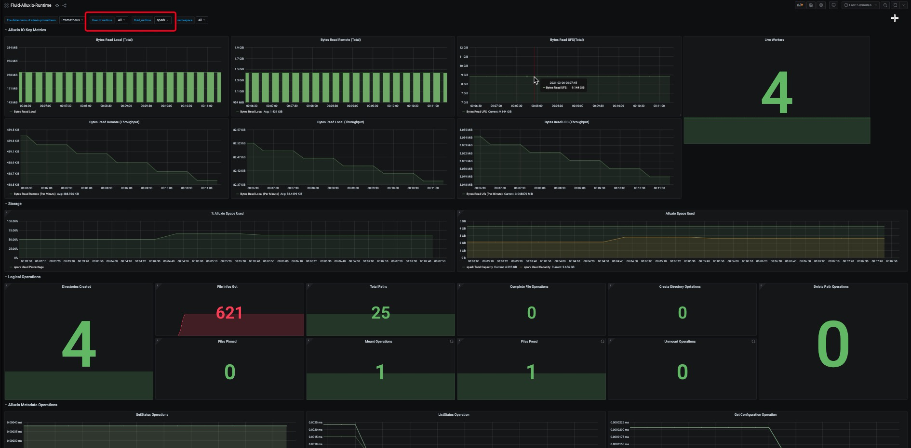

Table of Contents
=================

* [部署 prometheus 和 grafana 监控 Fluid 应用](#部署-prometheus-和-grafana-监控-fluid-应用)
   * [1. 部署或配置 Prometheus](#1-部署或配置-prometheus)
   * [2. 部署 grafana](#2-部署-grafana)
   * [3. 配置 grafana](#3-配置-grafana)

Created by [gh-md-toc](https://github.com/ekalinin/github-markdown-toc)

### 部署 prometheus 和 grafana 监控 Fluid 应用
注：prometheus 需要In-Cluster部署


#### 1. 部署或配置 Prometheus

如果集群内无 prometheus:
```shell
$ cd fluid
$ kubectl apply -f monitoring/prometheus.yaml
```

如集群内有 prometheus,可将以下配置写到 prometheus 配置文件中:
```yaml
scrape_configs:
  - job_name: 'alluxio master'
    metrics_path: /metrics/prometheus
    kubernetes_sd_configs:
      - role: endpoints
    relabel_configs:
    - source_labels: [__meta_kubernetes_endpoints_name]
      regex: .*-master-0
      action: keep
    - source_labels: [__meta_kubernetes_endpoint_port_name]
      regex: web
      action: keep
    - source_labels: [__meta_kubernetes_namespace]
      target_label: namespace
      replacement: $1
      action: replace
    - source_labels: [__meta_kubernetes_pod_label_release]
      target_label: fluid_runtime
      replacement: $1
      action: replace
```

#### 2. 部署 grafana


```shell
# docker 部署
$ docker run -d \
  -p 3000:3000 \
  --name=grafana \
  --restart=always \
  --name grafana \
  grafana/grafana

# In-CLuster 部署
$ cd fluid
$ kubectl apply -f monitoring/grafana.yaml 
```


#### 3. 配置 grafana

1. 登录 grafana
如果以docker 方式部署，访问 `http://$grafana-node-ip:3000`;以 In-CLuster 方式部署，访问`http://$grafana-node-ip:NodePort`，默认账号密码 `admin:admin`:
```
# 查看 NodePort
$ kubectl describe svc monitoring-grafana -n kube-system
```

2. 首先查看 prometheus svc 端口
```
$ kubectl get svc -n kube-system | grep prometheus-svc
prometheus-svc             NodePort    10.100.0.144   <none>        9090:31245/TCP           22h
$ kubectl describe svc prometheus-svc -n kube-system
Name:                     prometheus-svc
Namespace:                kube-system
Labels:                   kubernetes.io/name=Prometheus
                          name=prometheus-svc
Annotations:              kubectl.kubernetes.io/last-applied-configuration:
                            {"apiVersion":"v1","kind":"Service","metadata":{"annotations":{},"labels":{"kubernetes.io/name":"Prometheus","name":"prometheus-svc"},"nam...
Selector:                 app=prometheus
Type:                     NodePort
IP:                       10.100.0.144
Port:                     prometheus  9090/TCP
TargetPort:               9090/TCP
NodePort:                 prometheus  31245/TCP
Endpoints:                10.99.224.138:9090
Session Affinity:         None
External Traffic Policy:  Cluster
Events:                   <none>
```

3. 配置 prometheus data source

注: 如果 grafana In-Cluster 部署， URL 填写 Service Endpoints 即可；如果以 docker 方式部署，URL 填写prometheus 部署节点 ip:NodePort 即可
导入完成后点击Save & Test 显示 Data source is working 即可

4. 导入模板文件
grafana 选择导入模板 Json 文件 `fluid-prometheus-grafana-monitor.json`

5. 查看监控
在 grafana HOME 中知道名为Fluid-Prometheus-Grafana-Monitor视图即可，如下所示:

注：User of runtime 对应Fluid Alluxio runtime user; fluid_runtime 对应Fluid runtime name; namespace 对应Fluid runtime namespace
