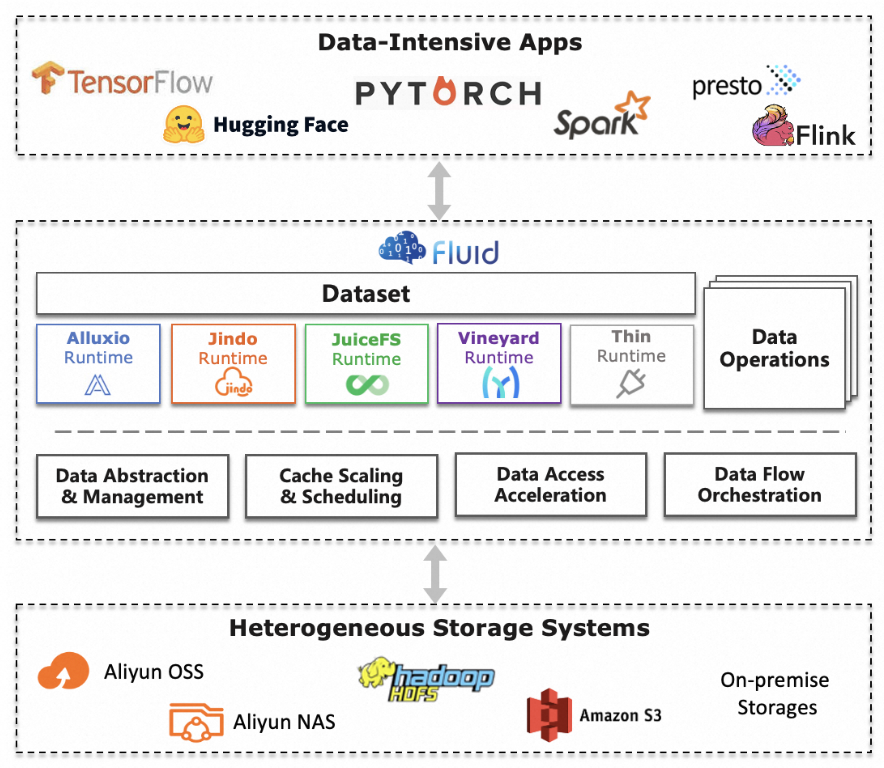
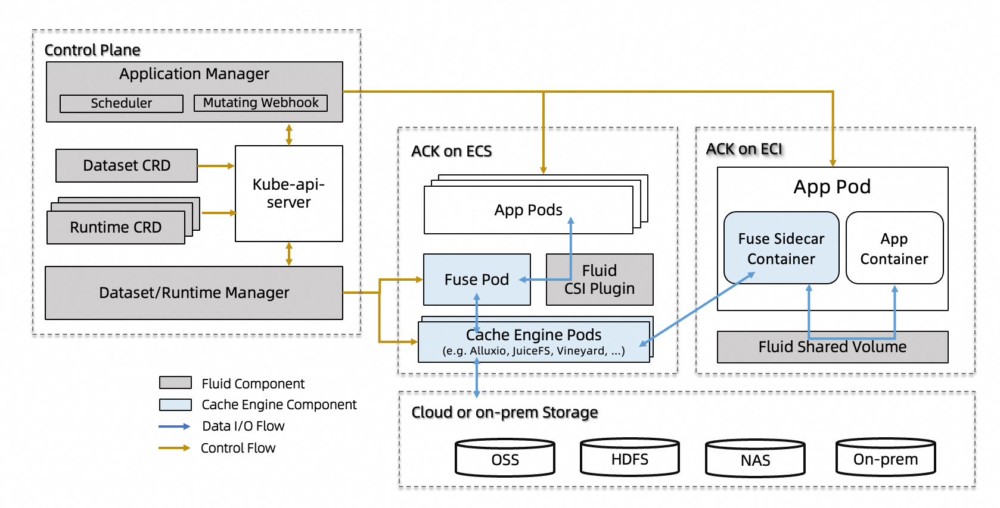
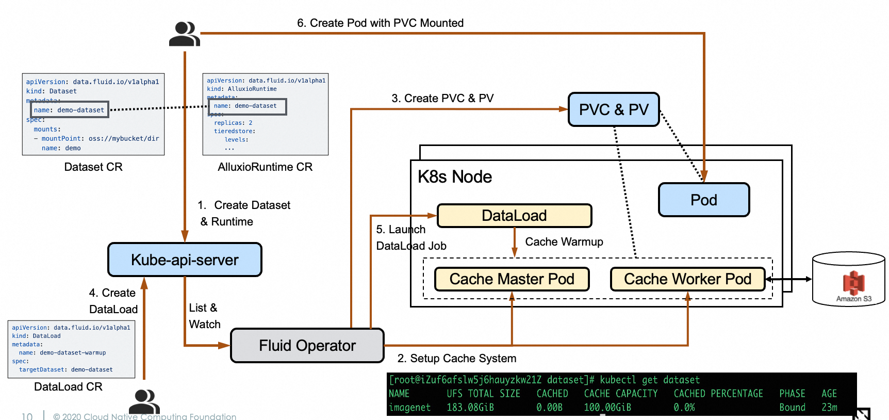

# Fluid Self-assessment
<!-- markdownlint-disable single-h1 no-emphasis-as-heading -->
<!-- cSpell:ignore roadmapping,Kubed,controlplanes,htpasswd -->

> This self-assessment document is intended to identify security insights of
> Fluid project, aid in roadmapping and a tool/documentation for onboarding new
> maintainers to the project.

Fluid has been in CNCF Sandbox since 2021, and is now applying for
[Incubation](https://github.com/cncf/toc/issues/1317).

# Table of contents

* [Metadata](#metadata)
   * [Security links](#security-links)
* [Overview](#overview)
   * [Actors](#actors)
   * [Actions](#actions)
   * [Background](#background)
   * [Goals](#goals)
   * [Non-goals](#non-goals)
* [Self-assessment use](#self-assessment-use)
* [Security functions and features](#security-functions-and-features)
* [Project compliance](#project-compliance)
* [Secure development practices](#secure-development-practices)
* [Security issue resolution](#security-issue-resolution)
* [Appendix](#appendix)

## Metadata

|                   |                                              |
| ----------------- | -------------------------------------------- |
| Assessment Stage  | In Progress                                  |
| Software          | <https://github.com/fluid-cloudnative/fluid>              |
| Security Provider | No                                           |
| Languages         | Go, Bash, Python                             |
| SBOM              | Fluid does not generate SBOMs currently     |

### Security links

| Document      | URL                                              |
| ------------- | ------------------------------------------------ |
| Security file | <https://github.com/fluid-cloudnative/fluid/blob/master/SECURITY.md>         |

## Overview

The Fluid Project empowers users with a flexible, open-source solution for data and workload orchestration and acceleration in Kubernetes environments. Fluid combines the benefits of high-performance data access with the ease of use and automation provided by Kubernetes. It provides a comprehensive set of components for managing and accelerating data access, enabling users to dynamically mount data sources without restarting pods, optimize performance through caching, and manage data lifecycle—all through Kubernetes-native APIs. Fluid ensures that AI and big data applications can efficiently, cost-effectively, and flexibly utilize data in cloud-native environments.

### Background

Kubernetes has become central to running data-intensive applications (e.g., AI training, big data analytics) due to their **elastic resource scaling** and **operational simplicity**. However, the **compute-storage decoupling** inherent in cloud-native architectures introduces high latency and bandwidth costs for data access, while Kubernetes’ native interfaces (e.g., CSI) focus only on storage provisioning, lacking support for **efficient dataset lifecycle management**.  

Though distributed caching engines (e.g., Alluxio, JuiceFS， Vineyard) emerged to mitigate these issues, their **complex deployment**, **high operational overhead**, and **poor synergy with dynamic compute workloads** in Kubernetes environments remained unresolved.  

**Fluid’s Solution**: By abstracting **elastic datasets (Dataset)** as first-class Kubernetes resources, Fluid provides a unified interface for data orchestration, automated caching, and cross-storage acceleration. It enables developers to manage data as intuitively as applications—**simplifying workflows**, **boosting performance**, and bridging the gap between cloud-native infrastructure and data-intensive workloads.  

**Core Value**: Fluid harmonizes compute and storage in cloud-native ecosystems, **reducing complexity** and **accelerating innovation** for data-driven use cases.

### Actors

There are two core concepts: Dataset and Runtime in Fluid. To support these two concepts, Fluid as a project bundles the following actors together:

#### Dataset/Runtime Manager
The Dataset/Runtime Manager is the central controller in Fluid, responsible for the lifecycle management of datasets and their associated runtime engines. It extends Kubernetes-native APIs to provide declarative operations for datasets, including:  
- **Dataset Lifecycle Operations**:  
  - **Automated Provisioning**: Deploys and scales runtime engines (e.g., Alluxio workers) based on dataset definitions.  
  - **Data Operations Automation**: Manages fine-grained data preheating (e.g., preloading specific directories), metadata backup/restore for small-file-intensive scenarios, and cache retention policies to avoid performance degradation due to eviction.  
  - **Multi-Engine Coordination**: Supports hybrid runtimes (e.g., combining Alluxio for caching and ThinRuntime for direct storage access) under a unified dataset abstraction.  
  - **Dynamic Resource Adjustment**: Triggers elastic scaling of runtime engines in response to workload pressure or policy changes (e.g., horizontal scaling of JuiceFS workers).  

#### Application Scheduler  
The Application Scheduler enhances Kubernetes scheduling decisions for workloads using Fluid datasets. It acts as an intelligent plugin to the Kubernetes default scheduler, providing:  
- **Cache-Aware Pod Placement**:  
  - Prioritizes nodes with cached dataset fragments to minimize cross-zone/rack data transfers.  
  - Uses metrics from the Dataset Controller (e.g., cache hit rate, node load) to score candidate nodes.  
- **Conflict Resolution**:  
  - Ensures exclusive access to pinned datasets (e.g., GPU training jobs requiring dataset retention).  
  - Avoids over-subscription of cache nodes by balancing Pod distribution.  

#### Sidecar Webhook  
The Sidecar Webhook automates storage client injection for environments where CSI plugins are unsupported. Key responsibilities include:  
- **FUSE Sidecar Injection**: Replaces standard PVCs with Fluid-managed FUSE sidecar containers (e.g., Alluxio FUSE) to decouple storage clients from application containers. 
- **SDK and Dependency Injection**: Use Init Container to installs SDKs to a shared volume and configures environment variables (e.g., `LD_LIBRARY_PATH`).   
- **Proactive Data Prefetcher**: Preloads datasets into host PageCache during app initialization via parallel tasks.

#### Runtime Plugin  
The Runtime Plugin is a modular framework for integrating diverse data engines into Fluid. It abstracts common caching and storage behaviors to support:  
- **Engine-Specific Implementations**:  
  - *AlluxioRuntime*: Master-Worker architecture.  
  - *JuiceFSRuntime*: Peer-to-Peer architecture.  
  - *VinyardRuntime*: Peer-to-Peer architecture. 
  - *ThinRuntime*: Lightweight adapter for generic storage systems (e.g., S3, HDFS) without custom engine development.  
- **Unified Interface**: Exposes standardized APIs for quota management, cache tier configuration, and metrics collection across engines.  

#### CSI Plugin  
The CSI Plugin provides a Kubernetes-native interface for mounting Fluid datasets into Pods. It operates independently from application containers to ensure:  
- **Decoupled Upgrades**: Updates to the CSI driver do not disrupt running workloads.  
- **Automated FUSE Recovery**: Self-healing mounts via health checks and auto-restart, ensuring continuous data access in Kubernetes.  
- **Resource Isolation**: Enforces CPU/memory limits on storage client Pods to prevent resource contention.  
- **Observability Integration**: Emits Kubernetes-native metrics (e.g., volume mount latency) and logs for monitoring via Prometheus/Grafana.  

### Actions

Fluid follows the Kubernetes declarative model where users interact with the
system by creating, updating and deleting Kubernetes custom resources. The main
actions flow through several key components:

1. **Define Datasets & Runtime**: Users submit CRs (`Dataset`, `Runtime`) to declare data sources, caching engines (Alluxio/JuiceFS/Vineyard and etc), and preloading rules.  
1. **Provision Caching Infrastructure**: The Dataset/Runtime Controller deploys caching engines and provisions PV/PVCs.  
1. **Define Data Prefetch Policy (Optional)**:
   - Users submit CRs to declare preload rules.  
   - The DataLoad Controller triggers parallel preload jobs to populate caches.  
1. **Define workload with Fluid Dataset**:Users deploy Pods referencing the Dataset’s PVC.  
1. **Data-Aware Scheduler**: The Data-Aware Scheduler prioritizes nodes with cached data for Pod placement.  
1. **Mount and Access**:  Fluid’s CSI/Sidecar Layer mounts cached data to Pods, isolating storage clients.  
1. **Transparent Acceleration**:  Applications access data via PVCs as local files, leveraging preloaded caches. 

The security boundary between components is maintained through:

#### **Security Model**  
- **RBAC Governance**: Restrict access to Fluid CRDs (e.g., `DataLoad`) and sensitive actions.  
- **Secure Communication**: Enforce mTLS between controllers and runtime plugins.  
- **Input Sanitization**: Validate CR fields (e.g., reject invalid `mountPoint` URLs).  

### Goals

Fluid is a **Kubernetes-native data and workload orchestrator** designed to empower AI and Big Data workloads with efficient access to heterogeneous storage systems through a unified abstraction layer. It achieves this by transforming distributed caching systems (Alluxio, JuiceFS, Vineyard, CubeFS, etc.) into **autonomous, observable, and elastic cache services** within Kubernetes, without requiring changes to applications.

#### **Core Objectives**  
1. **Unified Abstraction for Heterogeneous Caching Systems**  
   Provide a pluggable programming framework to integrate diverse caching engines (Alluxio, JuiceFS, etc.) with **standardized interfaces**, enabling developers to add new engines without reinventing control plane logic.  

2. **Unified Multi-Source & Dynamic Data Governance**
   - **One Dataset, Multiple Sources**: Decouple PVCs from static storage bindings, supporting hybrid data sources under a single Dataset abstraction.
   - **Runtime Data Mutability**: Enable dynamic addition/removal of data sources in running Pods via **Mutable Dataset API**, eliminating the need for Pod restarts.

3. **Data-Aware Scheduling & Elasticity**  
   - **Topology-Driven Placement**: Guide Kubernetes schedulers to prioritize nodes/storage zones with cached data, minimizing cross-region traffic.
   - **Dynamic Scaling**: Adjust cache capacity (e.g., Alluxio workers) to match workload demands.

4. **Transparent Data Access & Acceleration**  
   - **Consumption Interfaces**:  
     - **PVC-Based Access**: Mount cached datasets as standard Persistent Volumes through CSI/sidecar injection.  
     - **SDK Integration**: Automatically inject client libraries into Pods via Init Containers, zero image modification required.  
   - **Proactive Acceleration**:  
     - **Cache Preheating**: Preload hot datasets via `DataLoad` CRDs before workloads start.  
     - **App-Aware Warming**: Trigger prefetching based on application-specific access patterns (e.g., model training epochs).  

### Non-goals

Fluid's non-goals include:

* Implement storage or cache engine
* Provide Native Storage APIs like POSIX  
* Act as a General-Purpose Data Lake
* Exposing full set of Cache engine features

## Self-assessment use

This self-assessment is created by the Fluid team to perform an internal analysis of the project’s security. It is not intended to provide a security audit of Fluid, or function as an independent assessment or attestation of Fluid’s security health.

This document serves to provide Fluid users with an initial understanding of Fluid’s security posture, where to find existing security documentation, Fluid's plans for security, and a general overview of Fluid's security practices, both for the development of Fluid as well as the security of Fluid itself.

This document provides the CNCF TAG-Security with an initial understanding of Fluid to assist in a joint-assessment, which is necessary for projects under incubation. Taken together, this document and the joint-assessment serve as a cornerstone for if and when Fluid seeks graduation and is preparing for a security audit.

## Security functions and features

**Critical**

* **Fluid Controllers**: The Dataset/Runtime controller responsible for global dataset orchestration, cache policy management, and lifecycle control of distributed engines. If compromised, it could manipulate data routing paths, expose sensitive data, disrupt cache consistency, or cause cluster-wide data service outages.  
Hardening: Implements RBAC separation for different runtime controllers and webhook (e.g., AlluxioRuntimeController, JuicefsRuntimeController, Webhook) following least privilege principles.

* **Node Privilege Escalation Defenses**:  The Fluid design restricted the Node level components with Node-unique TLS certificates with embedded node identity and node only permissions, reducing the attack area.

**Security Relevant**

* **Security Scanning & Compliance Validation**:  
   Fluid's CI/CD pipeline integrates static code analysis (e.g., SonarQube) and container image vulnerability scanning (e.g., Trivy) to ensure artifact integrity, eliminate known vulnerabilities, and enforce open-source license compliance.

* **Dataset Access Control**:  
   Extends Kubernetes RBAC to govern dataset access permissions, restricting unauthorized users or service accounts from mounting or modifying sensitive datasets to prevent privilege escalation.

* **Sensitive Data Isolation**:  
   Supports storing cache metadata (e.g., access keys, certificates) in namespace-scoped Secrets to enforce isolation. Limits binding between `Dataset` CRDs and Secrets to prevent cross-namespace credential leakage.

## Project compliance

## Secure development practices

**Development Pipeline**

* The Fluid project has [clear contributing guidelines](https://github.com/fluid-cloudnative/fluid/blob/master/CONTRIBUTING.md).  
* Contributions are made via GitHub pull requests
* Pull request will trigger a Github workflow including tests below
  - Type check and lint ci.
  - Trivy scan is adopted to scan vulnerabilities for every image.
  - Unit tests and e2e tests.
  - Automatic code coverage using [codecov.io](https://app.codecov.io/) is
 generated in the PR for each submitted
* Code Review
  - Changes must be reviewed and merged by the project [maintainers](https://github.com/fluid-cloudnative/fluid/blob/master/MAINTAINERS_COMMITTERS.md).
* Release
  - The release process of a new version of OpenYurt(involving changelog, documents, helm charts) is detailed in the [release process document](https://github.com/fluid-cloudnative/community/blob/master/operations/release.md).
* The Fluid project run many linters and unit tests first, then e2e suite as required. If
   PR is touching a major feature, we run optional e2e feature suite. Most
   testing is configured via
   [github workflow](https://github.com/fluid-cloudnative/fluid/tree/master/.github/workflows)
   and on top we run GH action based checks.
* Contributors are not required to sign commits, but they must sign-off the
   code for DCO.
* Container images or other release artifacts we build are immutable or
   signed at the time.
* Administrators cannot bypass these Prow controls, force pushing is disabled
   regardless of permissions
* We have scheduled scans for CVEs with OSV-scanner , and security linters to find vulnerabilities in code,
   but no CVE scanner is run on PRs (yet)

**Communication Channels**

- Community members use Github, [Ding Talk](https://github.com/fluid-cloudnative/fluid?tab=readme-ov-file#community), [Wechat Group](https://github.com/fluid-cloudnative/fluid?tab=readme-ov-file#community) and [Fluid Community Slack](https://cloud-native.slack.com/archives/C02ADG209SP) to communicate and discuss PRs.
- [Community meetings](https://github.com/fluid-cloudnative/community/wiki/Meeting-Schedule) are held biweekly on Wednesdays for team members to discuss releases, feature proposals, and user issues.  
- If you missed the previous community meeting, you can still find the notes
   [here](https://github.com/fluid-cloudnative/community/wiki/Meeting-Schedule)
   and recordings
   [here](https://github.com/fluid-cloudnative/community/wiki/Meeting-Agenda-and-Notes). The minutes and recording for each meeting are openly available.
- Users can post bug reports, feature requests, and support requests on [Github issues](https://github.com/fluid-cloudnative/fluid/issues).  
- Find more information about Fluid on [Fluid Website](https://fluid-cloudnative.github.io/)

### Ecosystem

Fluid is deeply integrated into the cloud native ecosystem. It integrates with
OpenStack Ironic for provisioning operations and functions as a provider within
the Cluster API (CAPI) ecosystem, implementing the CAPI specification for
declarative management of bare metal infrastructure. As part of both the
Kubernetes and CAPI ecosystems, Fluid provides the foundation for organizations
to treat physical infrastructure as programmable resources within their
Kubernetes clusters.

## Security issue resolution

Security disclosure process and resolution is detailed in the project's
[security policy](https://github.com/fluid-cloudnative/fluid/blob/master/SECURITY.md) in detail.

Examples of past security advisories can be found in Appendix.

## Appendix

**Known Issues Over Time**

Fluid has had two vulnerabilities:

* [On a compromised node, the fluid-csi service account can be used to modify node specs](https://github.com/fluid-cloudnative/fluid/security/advisories/GHSA-93xx-cvmc-9w3v)
* [OS Command Injection for Fluid Users with JuicefsRuntime](https://github.com/fluid-cloudnative/fluid/security/advisories/GHSA-wx8q-4gm9-rj2g)

**OpenSSF Best Practices**

Fluid has passing page in
[CII/OpenSSF Best Practices](https://bestpractices.coreinfrastructure.org/projects/4886)
and is at 100% completion level, working towards the Silver badge.

### Case Studies

* **Case Study: Empowers Alibaba’s AI Infrastructure**  
Fluid streamlined Alibaba’s large-scale AI training pipelines through its cloud-native data orchestration capabilities:  

1. **Unified Data Governance**  
   Fluid abstracted 5,000+ datasets across OSS/HDFS/NAS into Kubernetes-native objects, reducing storage integration complexity by 70% via declarative APIs.  

2. **Intelligent Cache Orchestration**  
   Automated scaling of distributed caches balanced GPU utilization across 2,000+ concurrent jobs, achieving 40% higher throughput and 30% fewer GPU idle cycles through data-aware scheduling.  

3. **Seamless Upgrades**  
   Fluid’s runtime-agnostic architecture enabled zero-downtime upgrades of underlying storage engines, ensuring continuous model training across 10,000+ nodes.  

More info is in [case study](https://fluid-cloudnative.github.io/docs/case-study/alibaba-case-study)

* **Case Study: Accelerate Metabit’s Quantitative Research**  
Fluid streamlined Metabit’s cloud-based quantitative ML workflows through:  

1. **Unified Data Access**  
   Abstracted multi-cloud datasets (AWS/Azure) into Kubernetes-native resources, cutting cross-storage integration effort by 50% via declarative APIs.  

2. **Elastic Resource Orchestration**  
   Auto-scaled distributed caches across spot instances, achieving 35% faster model iteration via on-demand data locality optimization.  

3. **Runtime Flexibility**  
   Pluggable caching engines supported dynamic algorithm validation across 200+ concurrent experiments without infrastructure changes.  

4. **Secure Multi-Tenancy**  
   Namespace-isolated datasets enabled parallel research teams to securely share petabyte-scale financial data with zero leakage risks.  

More info is in [case study](https://fluid-cloudnative.github.io/docs/case-study/metabit-trading-case-study)

* **Case Study: Simplify Xiaomi’s Cross-Cloud Data Integration**  
Fluid enabled Xiaomi to unify IoT data workflows across hybrid clouds with:  

1. **Rapid Ecosystem Integration**  
   Fluid’s extensible framework reduced CSI Plugin development from days to **2-3 hours**, eliminating vendor lock-in risks.  

2. **Secure Data Abstraction**  
   Custom access protocols were encapsulated behind Fluid’s Kubernetes-native APIs, ensuring sensitive IoT data logic remained opaque to public cloud providers.  

3. **Zero-Overhead Deployment**  
   CSI or FUSE-based sidecar mode enabled non-disruptive access to Serverful/Serverless container system without modifying legacy client applications.  

 More info is in [case study](https://www.infoq.cn/article/kco7hi5tcve08yswniw7)

More use-cases can be found in our
[ADOPTERS.md](https://github.com/fluid-cloudnative/fluid/blob/master/ADOPTERS.md).

### Related Projects / Vendors

* [Vineyard](https://github.com/v6d-io/v6d) - A Fluid runtime used for sharing distributed data in big data tasks. It facilitates efficient data handling and processing across distributed systems. See [reference](https://github.com/fluid-cloudnative/fluid-client-python/blob/master/examples/03_dataflow_with_vineyard/vineyard-en.ipynb)

* [KServe](https://kubeflow.org/) - Utilizes Fluid to accelerate the loading of large language models, enhancing performance in model serving environments. See [Reference](https://github.com/kserve/kserve/blob/master/docs/samples/fluid/README.md).

* [KubeDL](https://kubedl.io/) - Employs Fluid as a caching engine to improve dataset access speed, reducing training time and increasing GPU utilization and model training efficiency. See [Reference](https://github.com/kubedl-io/kubedl/blob/master/docs/cache_backend.md).

* [CubeFS](https://cubefs.io/) - Combines with Fluid to provide powerful dataset management, data access acceleration, and enhanced observability, along with resource management capabilities. See [Reference](https://github.com/fluid-cloudnative/fluid/blob/master/addons/cubefs/v3.2/dev-guide/cubefs-v3.2.md)

* [Knative](https://knative.dev/) - Uses Fluid in sidecar mode to accelerate data access, eliminating the need for CSI plugin installation, thus simplifying deployment. See [Reference](https://github.com/fluid-cloudnative/fluid/blob/master/docs/en/samples/knative.md).

* [Open Cluster Management](https://open-cluster-management.io/) - Leverages Fluid to enhance data access across multiple managed Kubernetes clusters, improving efficiency and data handling across diverse environments. See [Reference](https://github.com/open-cluster-management-io/addon-contrib/tree/main/fluid-addon). 

